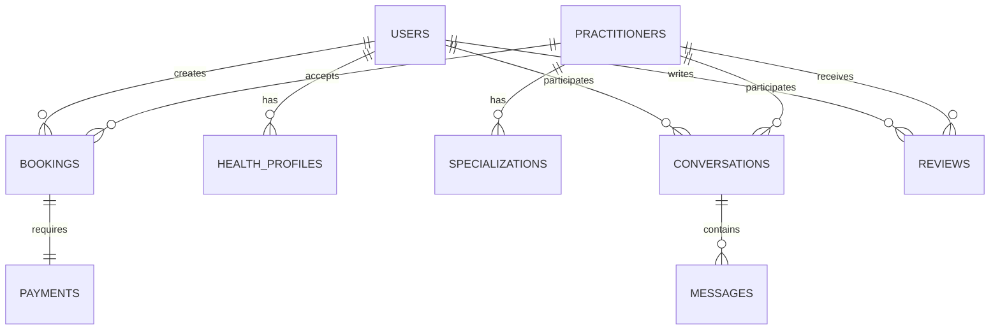

# Klear Karma Database Schema Documentation

## Table of Contents

1. [Overview](#overview)
2. [Database Architecture](#database-architecture)
3. [Core Entities](#core-entities)
4. [User Management](#user-management)
5. [Practitioner Management](#practitioner-management)
6. [Booking and Scheduling](#booking-and-scheduling)
7. [Payment and Billing](#payment-and-billing)
8. [Communication and Messaging](#communication-and-messaging)
9. [Health Records](#health-records)
10. [Content and Reviews](#content-and-reviews)
11. [Analytics and Tracking](#analytics-and-tracking)
12. [System and Configuration](#system-and-configuration)
13. [Indexes and Performance](#indexes-and-performance)
14. [Data Relationships](#data-relationships)
15. [Migration Strategy](#migration-strategy)

---

## Overview

Klear Karma's database schema is designed to support a comprehensive digital wellness platform connecting users with holistic health practitioners. The schema emphasizes data integrity, scalability, privacy, and compliance with healthcare regulations.

### Design Principles

- **HIPAA Compliance:** Secure handling of health information
- **GDPR Compliance:** Privacy by design and data portability
- **Scalability:** Horizontal and vertical scaling capabilities
- **Data Integrity:** Strong referential integrity and constraints
- **Audit Trail:** Complete audit logging for all sensitive operations
- **Performance:** Optimized for read-heavy workloads with strategic indexing

### Technology Stack

- **Primary Database:** PostgreSQL 15+ (ACID compliance, JSON support)
- **Read Replicas:** PostgreSQL read replicas for scaling
- **Cache Layer:** Redis for session management and caching
- **Search Engine:** Elasticsearch for full-text search
- **Analytics:** ClickHouse for real-time analytics
- **File Storage:** AWS S3 for file and media storage

---

## Database Architecture

### Multi-Database Strategy

```
┌─────────────────┐    ┌─────────────────┐    ┌─────────────────┐
│   Primary DB    │    │   Analytics DB  │    │   Search Index  │
│  (PostgreSQL)   │    │  (ClickHouse)   │    │ (Elasticsearch) │
│                 │    │                 │    │                 │
│ • User Data     │    │ • Events        │    │ • Practitioners │
│ • Bookings      │    │ • Metrics       │    │ • Content       │
│ • Payments      │    │ • Logs          │    │ • Reviews       │
│ • Messages      │    │ • Aggregations  │    │ • Health Info   │
└─────────────────┘    └─────────────────┘    └─────────────────┘
         │                       │                       │
         └───────────────────────┼───────────────────────┘
                                 │
                    ┌─────────────────┐
                    │   Cache Layer   │
                    │    (Redis)      │
                    │                 │
                    │ • Sessions      │
                    │ • Rate Limits   │
                    │ • Temp Data     │
                    └─────────────────┘
```

### Sharding Strategy

**Horizontal Partitioning:**
- User data sharded by `user_id` hash
- Booking data partitioned by date ranges
- Message data partitioned by conversation
- Analytics data partitioned by time periods

**Vertical Partitioning:**
- Separate databases for different domains
- Hot data vs. cold data separation
- Sensitive data isolation

---

## Core Entities

### Entity Relationship Overview



---

## User Management

### users

```sql
CREATE TABLE users (
    id UUID PRIMARY KEY DEFAULT gen_random_uuid(),
    email VARCHAR(255) UNIQUE NOT NULL,
    email_verified BOOLEAN DEFAULT FALSE,
    email_verified_at TIMESTAMP WITH TIME ZONE,
    password_hash VARCHAR(255) NOT NULL,
    first_name VARCHAR(100) NOT NULL,
    last_name VARCHAR(100) NOT NULL,
    date_of_birth DATE,
    phone_number VARCHAR(20),
    phone_verified BOOLEAN DEFAULT FALSE,
    phone_verified_at TIMESTAMP WITH TIME ZONE,
    profile_image_url TEXT,
    status user_status DEFAULT 'active',
    last_login_at TIMESTAMP WITH TIME ZONE,
    login_count INTEGER DEFAULT 0,
    timezone VARCHAR(50) DEFAULT 'UTC',
    language VARCHAR(10) DEFAULT 'en',
    created_at TIMESTAMP WITH TIME ZONE DEFAULT NOW(),
    updated_at TIMESTAMP WITH TIME ZONE DEFAULT NOW(),
    deleted_at TIMESTAMP WITH TIME ZONE,
    
    CONSTRAINT users_email_format CHECK (email ~* '^[A-Za-z0-9._%+-]+@[A-Za-z0-9.-]+\.[A-Za-z]{2,}$'),
    CONSTRAINT users_phone_format CHECK (phone_number ~* '^\+?[1-9]\d{1,14}$'),
    CONSTRAINT users_name_length CHECK (LENGTH(first_name) >= 1 AND LENGTH(last_name) >= 1)
);

CREATE TYPE user_status AS ENUM ('active', 'inactive', 'suspended', 'deleted');

CREATE INDEX idx_users_email ON users(email) WHERE deleted_at IS NULL;
CREATE INDEX idx_users_phone ON users(phone_number) WHERE deleted_at IS NULL;
CREATE INDEX idx_users_status ON users(status) WHERE deleted_at IS NULL;
CREATE INDEX idx_users_created_at ON users(created_at);
```

### user_profiles

```sql
CREATE TABLE user_profiles (
    id UUID PRIMARY KEY DEFAULT gen_random_uuid(),
    user_id UUID NOT NULL REFERENCES users(id) ON DELETE CASCADE,
    bio TEXT,
    gender gender_type,
    occupation VARCHAR(100),
    emergency_contact_name VARCHAR(100),
    emergency_contact_phone VARCHAR(20),
    emergency_contact_relationship VARCHAR(50),
    address_line1 VARCHAR(255),
    address_line2 VARCHAR(255),
    city VARCHAR(100),
    state VARCHAR(100),
    postal_code VARCHAR(20),
    country VARCHAR(2) DEFAULT 'US',
    preferences JSONB DEFAULT '{}',
    privacy_settings JSONB DEFAULT '{}',
    notification_settings JSONB DEFAULT '{}',
    created_at TIMESTAMP WITH TIME ZONE DEFAULT NOW(),
    updated_at TIMESTAMP WITH TIME ZONE DEFAULT NOW(),
    
    UNIQUE(user_id)
);

CREATE TYPE gender_type AS ENUM ('male', 'female', 'non_binary', 'prefer_not_to_say', 'other');

CREATE INDEX idx_user_profiles_user_id ON user_profiles(user_id);
CREATE INDEX idx_user_profiles_location ON user_profiles(city, state, country);
```

### user_authentication

```sql
CREATE TABLE user_authentication (
    id UUID PRIMARY KEY DEFAULT gen_random_uuid(),
    user_id UUID NOT NULL REFERENCES users(id) ON DELETE CASCADE,
    provider auth_provider NOT NULL,
    provider_id VARCHAR(255),
    access_token_hash VARCHAR(255),
    refresh_token_hash VARCHAR(255),
    token_expires_at TIMESTAMP WITH TIME ZONE,
    two_factor_enabled BOOLEAN DEFAULT FALSE,
    two_factor_secret VARCHAR(255),
    backup_codes TEXT[],
    last_used_at TIMESTAMP WITH TIME ZONE,
    created_at TIMESTAMP WITH TIME ZONE DEFAULT NOW(),
    updated_at TIMESTAMP WITH TIME ZONE DEFAULT NOW(),
    
    UNIQUE(user_id, provider)
);

CREATE TYPE auth_provider AS ENUM ('email', 'google', 'apple', 'facebook', 'microsoft');

CREATE INDEX idx_user_auth_user_id ON user_authentication(user_id);
CREATE INDEX idx_user_auth_provider ON user_authentication(provider, provider_id);
```

### user_sessions

```sql
CREATE TABLE user_sessions (
    id UUID PRIMARY KEY DEFAULT gen_random_uuid(),
    user_id UUID NOT NULL REFERENCES users(id) ON DELETE CASCADE,
    session_token VARCHAR(255) UNIQUE NOT NULL,
    device_info JSONB,
    ip_address INET,
    user_agent TEXT,
    location JSONB,
    expires_at TIMESTAMP WITH TIME ZONE NOT NULL,
    last_activity_at TIMESTAMP WITH TIME ZONE DEFAULT NOW(),
    created_at TIMESTAMP WITH TIME ZONE DEFAULT NOW(),
    
    CONSTRAINT session_expires_future CHECK (expires_at > created_at)
);

CREATE INDEX idx_user_sessions_user_id ON user_sessions(user_id);
CREATE INDEX idx_user_sessions_token ON user_sessions(session_token);
CREATE INDEX idx_user_sessions_expires ON user_sessions(expires_at);
```

---

## Practitioner Management

### practitioners

```sql
CREATE TABLE practitioners (
    id UUID PRIMARY KEY DEFAULT gen_random_uuid(),
    user_id UUID NOT NULL REFERENCES users(id) ON DELETE CASCADE,
    license_number VARCHAR(100),
    license_state VARCHAR(2),
    license_expiry DATE,
    bio TEXT NOT NULL,
    years_experience INTEGER DEFAULT 0,
    education JSONB DEFAULT '[]',
    certifications JSONB DEFAULT '[]',
    languages VARCHAR(255)[] DEFAULT '{}',
    consultation_fee_min INTEGER, -- in cents
    consultation_fee_max INTEGER, -- in cents
    session_duration_min INTEGER DEFAULT 30, -- in minutes
    session_duration_max INTEGER DEFAULT 120, -- in minutes
    response_time_hours INTEGER DEFAULT 24,
    rating DECIMAL(3,2) DEFAULT 0.00,
    total_reviews INTEGER DEFAULT 0,
    total_sessions INTEGER DEFAULT 0,
    verification_status verification_status DEFAULT 'pending',
    verification_documents JSONB DEFAULT '[]',
    verified_at TIMESTAMP WITH TIME ZONE,
    verified_by UUID REFERENCES users(id),
    status practitioner_status DEFAULT 'active',
    availability_timezone VARCHAR(50) DEFAULT 'UTC',
    created_at TIMESTAMP WITH TIME ZONE DEFAULT NOW(),
    updated_at TIMESTAMP WITH TIME ZONE DEFAULT NOW(),
    
    UNIQUE(user_id),
    CONSTRAINT practitioners_experience_positive CHECK (years_experience >= 0),
    CONSTRAINT practitioners_fee_valid CHECK (consultation_fee_min <= consultation_fee_max),
    CONSTRAINT practitioners_duration_valid CHECK (session_duration_min <= session_duration_max),
    CONSTRAINT practitioners_rating_range CHECK (rating >= 0 AND rating <= 5)
);

CREATE TYPE verification_status AS ENUM ('pending', 'in_review', 'verified', 'rejected', 'suspended');
CREATE TYPE practitioner_status AS ENUM ('active', 'inactive', 'on_break', 'suspended');

CREATE INDEX idx_practitioners_user_id ON practitioners(user_id);
CREATE INDEX idx_practitioners_verification ON practitioners(verification_status);
CREATE INDEX idx_practitioners_status ON practitioners(status);
CREATE INDEX idx_practitioners_rating ON practitioners(rating DESC);
CREATE INDEX idx_practitioners_fee_range ON practitioners(consultation_fee_min, consultation_fee_max);
```

### specializations

```sql
CREATE TABLE specializations (
    id UUID PRIMARY KEY DEFAULT gen_random_uuid(),
    name VARCHAR(100) UNIQUE NOT NULL,
    category VARCHAR(50) NOT NULL,
    description TEXT,
    icon_url TEXT,
    color_code VARCHAR(7), -- hex color
    sort_order INTEGER DEFAULT 0,
    active BOOLEAN DEFAULT TRUE,
    created_at TIMESTAMP WITH TIME ZONE DEFAULT NOW(),
    updated_at TIMESTAMP WITH TIME ZONE DEFAULT NOW()
);

CREATE INDEX idx_specializations_category ON specializations(category);
CREATE INDEX idx_specializations_active ON specializations(active);
CREATE INDEX idx_specializations_sort ON specializations(sort_order);
```

### practitioner_specializations

```sql
CREATE TABLE practitioner_specializations (
    id UUID PRIMARY KEY DEFAULT gen_random_uuid(),
    practitioner_id UUID NOT NULL REFERENCES practitioners(id) ON DELETE CASCADE,
    specialization_id UUID NOT NULL REFERENCES specializations(id) ON DELETE CASCADE,
    proficiency_level proficiency_level DEFAULT 'intermediate',
    years_experience INTEGER DEFAULT 0,
    certification_details JSONB,
    created_at TIMESTAMP WITH TIME ZONE DEFAULT NOW(),
    
    UNIQUE(practitioner_id, specialization_id)
);

CREATE TYPE proficiency_level AS ENUM ('beginner', 'intermediate', 'advanced', 'expert');

CREATE INDEX idx_prac_spec_practitioner ON practitioner_specializations(practitioner_id);
CREATE INDEX idx_prac_spec_specialization ON practitioner_specializations(specialization_id);
```

### practitioner_availability

```sql
CREATE TABLE practitioner_availability (
    id UUID PRIMARY KEY DEFAULT gen_random_uuid(),
    practitioner_id UUID NOT NULL REFERENCES practitioners(id) ON DELETE CASCADE,
    day_of_week INTEGER NOT NULL, -- 0=Sunday, 6=Saturday
    start_time TIME NOT NULL,
    end_time TIME NOT NULL,
    timezone VARCHAR(50) NOT NULL,
    session_types session_type[] DEFAULT '{}',
    break_duration INTEGER DEFAULT 15, -- minutes between sessions
    active BOOLEAN DEFAULT TRUE,
    created_at TIMESTAMP WITH TIME ZONE DEFAULT NOW(),
    updated_at TIMESTAMP WITH TIME ZONE DEFAULT NOW(),
    
    CONSTRAINT availability_day_range CHECK (day_of_week >= 0 AND day_of_week <= 6),
    CONSTRAINT availability_time_order CHECK (start_time < end_time)
);

CREATE TYPE session_type AS ENUM ('video_call', 'phone_call', 'in_person', 'chat');

CREATE INDEX idx_prac_avail_practitioner ON practitioner_availability(practitioner_id);
CREATE INDEX idx_prac_avail_day ON practitioner_availability(day_of_week);
CREATE INDEX idx_prac_avail_active ON practitioner_availability(active);
```

### practitioner_blocked_times

```sql
CREATE TABLE practitioner_blocked_times (
    id UUID PRIMARY KEY DEFAULT gen_random_uuid(),
    practitioner_id UUID NOT NULL REFERENCES practitioners(id) ON DELETE CASCADE,
    start_datetime TIMESTAMP WITH TIME ZONE NOT NULL,
    end_datetime TIMESTAMP WITH TIME ZONE NOT NULL,
    reason VARCHAR(255),
    recurring BOOLEAN DEFAULT FALSE,
    recurrence_pattern JSONB, -- for recurring blocks
    created_at TIMESTAMP WITH TIME ZONE DEFAULT NOW(),
    
    CONSTRAINT blocked_time_order CHECK (start_datetime < end_datetime)
);

CREATE INDEX idx_prac_blocked_practitioner ON practitioner_blocked_times(practitioner_id);
CREATE INDEX idx_prac_blocked_datetime ON practitioner_blocked_times(start_datetime, end_datetime);
```

---

## Booking and Scheduling

### services

```sql
CREATE TABLE services (
    id UUID PRIMARY KEY DEFAULT gen_random_uuid(),
    practitioner_id UUID NOT NULL REFERENCES practitioners(id) ON DELETE CASCADE,
    name VARCHAR(255) NOT NULL,
    description TEXT,
    duration_minutes INTEGER NOT NULL,
    price_cents INTEGER NOT NULL,
    currency VARCHAR(3) DEFAULT 'USD',
    session_types session_type[] DEFAULT '{}',
    max_participants INTEGER DEFAULT 1,
    preparation_instructions TEXT,
    follow_up_instructions TEXT,
    cancellation_policy JSONB,
    active BOOLEAN DEFAULT TRUE,
    created_at TIMESTAMP WITH TIME ZONE DEFAULT NOW(),
    updated_at TIMESTAMP WITH TIME ZONE DEFAULT NOW(),
    
    CONSTRAINT services_duration_positive CHECK (duration_minutes > 0),
    CONSTRAINT services_price_positive CHECK (price_cents >= 0),
    CONSTRAINT services_participants_positive CHECK (max_participants > 0)
);

CREATE INDEX idx_services_practitioner ON services(practitioner_id);
CREATE INDEX idx_services_active ON services(active);
CREATE INDEX idx_services_price ON services(price_cents);
```

### bookings

```sql
CREATE TABLE bookings (
    id UUID PRIMARY KEY DEFAULT gen_random_uuid(),
    user_id UUID NOT NULL REFERENCES users(id),
    practitioner_id UUID NOT NULL REFERENCES practitioners(id),
    service_id UUID NOT NULL REFERENCES services(id),
    scheduled_at TIMESTAMP WITH TIME ZONE NOT NULL,
    duration_minutes INTEGER NOT NULL,
    session_type session_type NOT NULL,
    status booking_status DEFAULT 'pending',
    location_type location_type,
    location_details JSONB,
    user_notes TEXT,
    practitioner_notes TEXT,
    internal_notes TEXT,
    price_cents INTEGER NOT NULL,
    currency VARCHAR(3) DEFAULT 'USD',
    discount_applied JSONB,
    cancellation_reason TEXT,
    cancelled_at TIMESTAMP WITH TIME ZONE,
    cancelled_by UUID REFERENCES users(id),
    completed_at TIMESTAMP WITH TIME ZONE,
    no_show_at TIMESTAMP WITH TIME ZONE,
    reminder_sent_at TIMESTAMP WITH TIME ZONE,
    follow_up_sent_at TIMESTAMP WITH TIME ZONE,
    created_at TIMESTAMP WITH TIME ZONE DEFAULT NOW(),
    updated_at TIMESTAMP WITH TIME ZONE DEFAULT NOW(),
    
    CONSTRAINT bookings_duration_positive CHECK (duration_minutes > 0),
    CONSTRAINT bookings_price_positive CHECK (price_cents >= 0),
    CONSTRAINT bookings_scheduled_future CHECK (scheduled_at > created_at)
);

CREATE TYPE booking_status AS ENUM (
    'pending', 'confirmed', 'in_progress', 'completed', 
    'cancelled', 'no_show', 'rescheduled'
);

CREATE TYPE location_type AS ENUM ('video_call', 'phone_call', 'in_person', 'chat');

CREATE INDEX idx_bookings_user ON bookings(user_id);
CREATE INDEX idx_bookings_practitioner ON bookings(practitioner_id);
CREATE INDEX idx_bookings_scheduled ON bookings(scheduled_at);
CREATE INDEX idx_bookings_status ON bookings(status);
CREATE INDEX idx_bookings_created ON bookings(created_at);

-- Partition by month for better performance
CREATE TABLE bookings_y2024m01 PARTITION OF bookings
FOR VALUES FROM ('2024-01-01') TO ('2024-02-01');
```

### booking_participants

```sql
CREATE TABLE booking_participants (
    id UUID PRIMARY KEY DEFAULT gen_random_uuid(),
    booking_id UUID NOT NULL REFERENCES bookings(id) ON DELETE CASCADE,
    user_id UUID NOT NULL REFERENCES users(id),
    role participant_role DEFAULT 'participant',
    joined_at TIMESTAMP WITH TIME ZONE,
    left_at TIMESTAMP WITH TIME ZONE,
    connection_quality JSONB,
    created_at TIMESTAMP WITH TIME ZONE DEFAULT NOW(),
    
    UNIQUE(booking_id, user_id)
);

CREATE TYPE participant_role AS ENUM ('host', 'participant', 'observer');

CREATE INDEX idx_booking_participants_booking ON booking_participants(booking_id);
CREATE INDEX idx_booking_participants_user ON booking_participants(user_id);
```

### booking_reschedule_requests

```sql
CREATE TABLE booking_reschedule_requests (
    id UUID PRIMARY KEY DEFAULT gen_random_uuid(),
    booking_id UUID NOT NULL REFERENCES bookings(id) ON DELETE CASCADE,
    requested_by UUID NOT NULL REFERENCES users(id),
    original_scheduled_at TIMESTAMP WITH TIME ZONE NOT NULL,
    new_scheduled_at TIMESTAMP WITH TIME ZONE NOT NULL,
    reason TEXT,
    status reschedule_status DEFAULT 'pending',
    responded_by UUID REFERENCES users(id),
    responded_at TIMESTAMP WITH TIME ZONE,
    response_notes TEXT,
    created_at TIMESTAMP WITH TIME ZONE DEFAULT NOW(),
    
    CONSTRAINT reschedule_different_time CHECK (original_scheduled_at != new_scheduled_at)
);

CREATE TYPE reschedule_status AS ENUM ('pending', 'approved', 'rejected', 'expired');

CREATE INDEX idx_reschedule_booking ON booking_reschedule_requests(booking_id);
CREATE INDEX idx_reschedule_status ON booking_reschedule_requests(status);
```

---

## Payment and Billing

### payment_methods

```sql
CREATE TABLE payment_methods (
    id UUID PRIMARY KEY DEFAULT gen_random_uuid(),
    user_id UUID NOT NULL REFERENCES users(id) ON DELETE CASCADE,
    type payment_method_type NOT NULL,
    provider payment_provider NOT NULL,
    provider_payment_method_id VARCHAR(255) NOT NULL,
    last_four VARCHAR(4),
    brand VARCHAR(50),
    expiry_month INTEGER,
    expiry_year INTEGER,
    billing_address JSONB,
    is_default BOOLEAN DEFAULT FALSE,
    active BOOLEAN DEFAULT TRUE,
    created_at TIMESTAMP WITH TIME ZONE DEFAULT NOW(),
    updated_at TIMESTAMP WITH TIME ZONE DEFAULT NOW(),
    
    CONSTRAINT payment_method_expiry_valid CHECK (
        (expiry_month IS NULL AND expiry_year IS NULL) OR
        (expiry_month BETWEEN 1 AND 12 AND expiry_year >= EXTRACT(YEAR FROM NOW()))
    )
);

CREATE TYPE payment_method_type AS ENUM ('card', 'bank_account', 'digital_wallet', 'crypto');
CREATE TYPE payment_provider AS ENUM ('stripe', 'paypal', 'apple_pay', 'google_pay', 'square');

CREATE INDEX idx_payment_methods_user ON payment_methods(user_id);
CREATE INDEX idx_payment_methods_default ON payment_methods(user_id, is_default) WHERE is_default = TRUE;
CREATE INDEX idx_payment_methods_active ON payment_methods(active);
```

### payments

```sql
CREATE TABLE payments (
    id UUID PRIMARY KEY DEFAULT gen_random_uuid(),
    booking_id UUID REFERENCES bookings(id),
    user_id UUID NOT NULL REFERENCES users(id),
    practitioner_id UUID NOT NULL REFERENCES practitioners(id),
    payment_method_id UUID REFERENCES payment_methods(id),
    amount_cents INTEGER NOT NULL,
    currency VARCHAR(3) DEFAULT 'USD',
    platform_fee_cents INTEGER DEFAULT 0,
    practitioner_amount_cents INTEGER NOT NULL,
    payment_intent_id VARCHAR(255),
    provider_transaction_id VARCHAR(255),
    status payment_status DEFAULT 'pending',
    payment_type payment_type DEFAULT 'booking',
    description TEXT,
    metadata JSONB DEFAULT '{}',
    processed_at TIMESTAMP WITH TIME ZONE,
    failed_at TIMESTAMP WITH TIME ZONE,
    failure_reason TEXT,
    refunded_amount_cents INTEGER DEFAULT 0,
    created_at TIMESTAMP WITH TIME ZONE DEFAULT NOW(),
    updated_at TIMESTAMP WITH TIME ZONE DEFAULT NOW(),
    
    CONSTRAINT payments_amount_positive CHECK (amount_cents > 0),
    CONSTRAINT payments_platform_fee_valid CHECK (platform_fee_cents >= 0),
    CONSTRAINT payments_practitioner_amount_valid CHECK (practitioner_amount_cents >= 0),
    CONSTRAINT payments_refund_valid CHECK (refunded_amount_cents <= amount_cents)
);

CREATE TYPE payment_status AS ENUM (
    'pending', 'processing', 'succeeded', 'failed', 
    'cancelled', 'refunded', 'partially_refunded'
);

CREATE TYPE payment_type AS ENUM ('booking', 'subscription', 'tip', 'refund', 'adjustment');

CREATE INDEX idx_payments_booking ON payments(booking_id);
CREATE INDEX idx_payments_user ON payments(user_id);
CREATE INDEX idx_payments_practitioner ON payments(practitioner_id);
CREATE INDEX idx_payments_status ON payments(status);
CREATE INDEX idx_payments_created ON payments(created_at);
```

### refunds

```sql
CREATE TABLE refunds (
    id UUID PRIMARY KEY DEFAULT gen_random_uuid(),
    payment_id UUID NOT NULL REFERENCES payments(id),
    amount_cents INTEGER NOT NULL,
    currency VARCHAR(3) DEFAULT 'USD',
    reason refund_reason NOT NULL,
    description TEXT,
    provider_refund_id VARCHAR(255),
    status refund_status DEFAULT 'pending',
    processed_at TIMESTAMP WITH TIME ZONE,
    failed_at TIMESTAMP WITH TIME ZONE,
    failure_reason TEXT,
    requested_by UUID NOT NULL REFERENCES users(id),
    approved_by UUID REFERENCES users(id),
    created_at TIMESTAMP WITH TIME ZONE DEFAULT NOW(),
    updated_at TIMESTAMP WITH TIME ZONE DEFAULT NOW(),
    
    CONSTRAINT refunds_amount_positive CHECK (amount_cents > 0)
);

CREATE TYPE refund_reason AS ENUM (
    'customer_request', 'cancellation', 'no_show', 
    'technical_issue', 'quality_issue', 'dispute', 'admin_adjustment'
);

CREATE TYPE refund_status AS ENUM ('pending', 'processing', 'succeeded', 'failed', 'cancelled');

CREATE INDEX idx_refunds_payment ON refunds(payment_id);
CREATE INDEX idx_refunds_status ON refunds(status);
CREATE INDEX idx_refunds_created ON refunds(created_at);
```

### practitioner_payouts

```sql
CREATE TABLE practitioner_payouts (
    id UUID PRIMARY KEY DEFAULT gen_random_uuid(),
    practitioner_id UUID NOT NULL REFERENCES practitioners(id),
    amount_cents INTEGER NOT NULL,
    currency VARCHAR(3) DEFAULT 'USD',
    period_start DATE NOT NULL,
    period_end DATE NOT NULL,
    payment_ids UUID[] NOT NULL,
    payout_method payout_method NOT NULL,
    payout_details JSONB,
    status payout_status DEFAULT 'pending',
    provider_payout_id VARCHAR(255),
    processed_at TIMESTAMP WITH TIME ZONE,
    failed_at TIMESTAMP WITH TIME ZONE,
    failure_reason TEXT,
    created_at TIMESTAMP WITH TIME ZONE DEFAULT NOW(),
    updated_at TIMESTAMP WITH TIME ZONE DEFAULT NOW(),
    
    CONSTRAINT payouts_amount_positive CHECK (amount_cents > 0),
    CONSTRAINT payouts_period_valid CHECK (period_start <= period_end)
);

CREATE TYPE payout_method AS ENUM ('bank_transfer', 'paypal', 'stripe', 'check', 'crypto');
CREATE TYPE payout_status AS ENUM ('pending', 'processing', 'paid', 'failed', 'cancelled');

CREATE INDEX idx_payouts_practitioner ON practitioner_payouts(practitioner_id);
CREATE INDEX idx_payouts_period ON practitioner_payouts(period_start, period_end);
CREATE INDEX idx_payouts_status ON practitioner_payouts(status);
```

---

## Communication and Messaging

### conversations

```sql
CREATE TABLE conversations (
    id UUID PRIMARY KEY DEFAULT gen_random_uuid(),
    type conversation_type NOT NULL,
    subject VARCHAR(255),
    status conversation_status DEFAULT 'active',
    last_message_at TIMESTAMP WITH TIME ZONE,
    last_message_id UUID,
    metadata JSONB DEFAULT '{}',
    created_at TIMESTAMP WITH TIME ZONE DEFAULT NOW(),
    updated_at TIMESTAMP WITH TIME ZONE DEFAULT NOW()
);

CREATE TYPE conversation_type AS ENUM ('direct', 'group', 'support', 'booking_related');
CREATE TYPE conversation_status AS ENUM ('active', 'archived', 'closed', 'blocked');

CREATE INDEX idx_conversations_type ON conversations(type);
CREATE INDEX idx_conversations_status ON conversations(status);
CREATE INDEX idx_conversations_last_message ON conversations(last_message_at DESC);
```

### conversation_participants

```sql
CREATE TABLE conversation_participants (
    id UUID PRIMARY KEY DEFAULT gen_random_uuid(),
    conversation_id UUID NOT NULL REFERENCES conversations(id) ON DELETE CASCADE,
    user_id UUID NOT NULL REFERENCES users(id),
    role participant_role DEFAULT 'participant',
    joined_at TIMESTAMP WITH TIME ZONE DEFAULT NOW(),
    left_at TIMESTAMP WITH TIME ZONE,
    last_read_at TIMESTAMP WITH TIME ZONE,
    notification_settings JSONB DEFAULT '{}',
    
    UNIQUE(conversation_id, user_id)
);

CREATE INDEX idx_conv_participants_conversation ON conversation_participants(conversation_id);
CREATE INDEX idx_conv_participants_user ON conversation_participants(user_id);
```

### messages

```sql
CREATE TABLE messages (
    id UUID PRIMARY KEY DEFAULT gen_random_uuid(),
    conversation_id UUID NOT NULL REFERENCES conversations(id) ON DELETE CASCADE,
    sender_id UUID NOT NULL REFERENCES users(id),
    content TEXT,
    message_type message_type DEFAULT 'text',
    attachments JSONB DEFAULT '[]',
    metadata JSONB DEFAULT '{}',
    reply_to_id UUID REFERENCES messages(id),
    edited_at TIMESTAMP WITH TIME ZONE,
    deleted_at TIMESTAMP WITH TIME ZONE,
    created_at TIMESTAMP WITH TIME ZONE DEFAULT NOW(),
    
    CONSTRAINT messages_content_or_attachments CHECK (
        (content IS NOT NULL AND LENGTH(content) > 0) OR 
        (attachments IS NOT NULL AND jsonb_array_length(attachments) > 0)
    )
);

CREATE TYPE message_type AS ENUM (
    'text', 'image', 'file', 'audio', 'video', 
    'system', 'booking_update', 'payment_update'
);

CREATE INDEX idx_messages_conversation ON messages(conversation_id, created_at DESC);
CREATE INDEX idx_messages_sender ON messages(sender_id);
CREATE INDEX idx_messages_type ON messages(message_type);
CREATE INDEX idx_messages_reply_to ON messages(reply_to_id);

-- Partition by month for better performance
CREATE TABLE messages_y2024m01 PARTITION OF messages
FOR VALUES FROM ('2024-01-01') TO ('2024-02-01');
```

### message_reactions

```sql
CREATE TABLE message_reactions (
    id UUID PRIMARY KEY DEFAULT gen_random_uuid(),
    message_id UUID NOT NULL REFERENCES messages(id) ON DELETE CASCADE,
    user_id UUID NOT NULL REFERENCES users(id),
    reaction_type VARCHAR(50) NOT NULL, -- emoji or reaction name
    created_at TIMESTAMP WITH TIME ZONE DEFAULT NOW(),
    
    UNIQUE(message_id, user_id, reaction_type)
);

CREATE INDEX idx_message_reactions_message ON message_reactions(message_id);
CREATE INDEX idx_message_reactions_user ON message_reactions(user_id);
```

### file_uploads

```sql
CREATE TABLE file_uploads (
    id UUID PRIMARY KEY DEFAULT gen_random_uuid(),
    uploader_id UUID NOT NULL REFERENCES users(id),
    filename VARCHAR(255) NOT NULL,
    original_filename VARCHAR(255) NOT NULL,
    file_size BIGINT NOT NULL,
    mime_type VARCHAR(100) NOT NULL,
    file_path TEXT NOT NULL,
    storage_provider VARCHAR(50) DEFAULT 's3',
    access_level access_level DEFAULT 'private',
    encryption_key_id VARCHAR(255),
    virus_scan_status scan_status DEFAULT 'pending',
    virus_scan_result JSONB,
    metadata JSONB DEFAULT '{}',
    expires_at TIMESTAMP WITH TIME ZONE,
    created_at TIMESTAMP WITH TIME ZONE DEFAULT NOW(),
    
    CONSTRAINT file_size_positive CHECK (file_size > 0)
);

CREATE TYPE access_level AS ENUM ('public', 'private', 'shared', 'temporary');
CREATE TYPE scan_status AS ENUM ('pending', 'clean', 'infected', 'error', 'skipped');

CREATE INDEX idx_file_uploads_uploader ON file_uploads(uploader_id);
CREATE INDEX idx_file_uploads_scan_status ON file_uploads(virus_scan_status);
CREATE INDEX idx_file_uploads_created ON file_uploads(created_at);
```

---

## Health Records

### health_profiles

```sql
CREATE TABLE health_profiles (
    id UUID PRIMARY KEY DEFAULT gen_random_uuid(),
    user_id UUID NOT NULL REFERENCES users(id) ON DELETE CASCADE,
    blood_type blood_type,
    height_cm INTEGER,
    weight_kg DECIMAL(5,2),
    allergies TEXT[],
    chronic_conditions TEXT[],
    current_medications JSONB DEFAULT '[]',
    past_surgeries JSONB DEFAULT '[]',
    family_history JSONB DEFAULT '{}',
    lifestyle_factors JSONB DEFAULT '{}',
    health_goals TEXT[],
    emergency_medical_info TEXT,
    physician_name VARCHAR(255),
    physician_contact VARCHAR(255),
    insurance_provider VARCHAR(255),
    insurance_policy_number VARCHAR(100),
    privacy_level privacy_level DEFAULT 'private',
    sharing_permissions JSONB DEFAULT '{}',
    created_at TIMESTAMP WITH TIME ZONE DEFAULT NOW(),
    updated_at TIMESTAMP WITH TIME ZONE DEFAULT NOW(),
    
    UNIQUE(user_id),
    CONSTRAINT health_height_valid CHECK (height_cm IS NULL OR (height_cm > 0 AND height_cm < 300)),
    CONSTRAINT health_weight_valid CHECK (weight_kg IS NULL OR (weight_kg > 0 AND weight_kg < 1000))
);

CREATE TYPE blood_type AS ENUM ('A+', 'A-', 'B+', 'B-', 'AB+', 'AB-', 'O+', 'O-', 'unknown');
CREATE TYPE privacy_level AS ENUM ('private', 'practitioners_only', 'shared', 'public');

CREATE INDEX idx_health_profiles_user ON health_profiles(user_id);
CREATE INDEX idx_health_profiles_privacy ON health_profiles(privacy_level);
```

### health_records

```sql
CREATE TABLE health_records (
    id UUID PRIMARY KEY DEFAULT gen_random_uuid(),
    user_id UUID NOT NULL REFERENCES users(id),
    practitioner_id UUID REFERENCES practitioners(id),
    booking_id UUID REFERENCES bookings(id),
    record_type health_record_type NOT NULL,
    title VARCHAR(255) NOT NULL,
    content TEXT,
    structured_data JSONB DEFAULT '{}',
    attachments UUID[] DEFAULT '{}',
    tags TEXT[] DEFAULT '{}',
    privacy_level privacy_level DEFAULT 'private',
    shared_with UUID[] DEFAULT '{}',
    created_at TIMESTAMP WITH TIME ZONE DEFAULT NOW(),
    updated_at TIMESTAMP WITH TIME ZONE DEFAULT NOW()
);

CREATE TYPE health_record_type AS ENUM (
    'assessment', 'treatment_plan', 'progress_note', 
    'lab_result', 'prescription', 'recommendation', 
    'exercise_plan', 'nutrition_plan', 'other'
);

CREATE INDEX idx_health_records_user ON health_records(user_id);
CREATE INDEX idx_health_records_practitioner ON health_records(practitioner_id);
CREATE INDEX idx_health_records_type ON health_records(record_type);
CREATE INDEX idx_health_records_created ON health_records(created_at DESC);
```

### health_record_sharing

```sql
CREATE TABLE health_record_sharing (
    id UUID PRIMARY KEY DEFAULT gen_random_uuid(),
    health_record_id UUID NOT NULL REFERENCES health_records(id) ON DELETE CASCADE,
    shared_by UUID NOT NULL REFERENCES users(id),
    shared_with UUID NOT NULL REFERENCES users(id),
    permission_level permission_level DEFAULT 'read',
    expires_at TIMESTAMP WITH TIME ZONE,
    revoked_at TIMESTAMP WITH TIME ZONE,
    access_count INTEGER DEFAULT 0,
    last_accessed_at TIMESTAMP WITH TIME ZONE,
    created_at TIMESTAMP WITH TIME ZONE DEFAULT NOW(),
    
    UNIQUE(health_record_id, shared_with),
    CONSTRAINT sharing_different_users CHECK (shared_by != shared_with)
);

CREATE TYPE permission_level AS ENUM ('read', 'comment', 'edit');

CREATE INDEX idx_health_sharing_record ON health_record_sharing(health_record_id);
CREATE INDEX idx_health_sharing_with ON health_record_sharing(shared_with);
CREATE INDEX idx_health_sharing_expires ON health_record_sharing(expires_at);
```

---

## Content and Reviews

### reviews

```sql
CREATE TABLE reviews (
    id UUID PRIMARY KEY DEFAULT gen_random_uuid(),
    booking_id UUID NOT NULL REFERENCES bookings(id),
    reviewer_id UUID NOT NULL REFERENCES users(id),
    practitioner_id UUID NOT NULL REFERENCES practitioners(id),
    rating INTEGER NOT NULL,
    title VARCHAR(255),
    content TEXT,
    aspects JSONB DEFAULT '{}', -- specific aspect ratings
    anonymous BOOLEAN DEFAULT FALSE,
    verified BOOLEAN DEFAULT FALSE,
    helpful_count INTEGER DEFAULT 0,
    reported_count INTEGER DEFAULT 0,
    status review_status DEFAULT 'published',
    moderated_by UUID REFERENCES users(id),
    moderated_at TIMESTAMP WITH TIME ZONE,
    moderation_notes TEXT,
    response_from_practitioner TEXT,
    response_at TIMESTAMP WITH TIME ZONE,
    created_at TIMESTAMP WITH TIME ZONE DEFAULT NOW(),
    updated_at TIMESTAMP WITH TIME ZONE DEFAULT NOW(),
    
    UNIQUE(booking_id),
    CONSTRAINT reviews_rating_range CHECK (rating >= 1 AND rating <= 5)
);

CREATE TYPE review_status AS ENUM ('draft', 'published', 'hidden', 'flagged', 'removed');

CREATE INDEX idx_reviews_practitioner ON reviews(practitioner_id);
CREATE INDEX idx_reviews_reviewer ON reviews(reviewer_id);
CREATE INDEX idx_reviews_rating ON reviews(rating);
CREATE INDEX idx_reviews_status ON reviews(status);
CREATE INDEX idx_reviews_created ON reviews(created_at DESC);
```

### review_helpfulness

```sql
CREATE TABLE review_helpfulness (
    id UUID PRIMARY KEY DEFAULT gen_random_uuid(),
    review_id UUID NOT NULL REFERENCES reviews(id) ON DELETE CASCADE,
    user_id UUID NOT NULL REFERENCES users(id),
    helpful BOOLEAN NOT NULL,
    created_at TIMESTAMP WITH TIME ZONE DEFAULT NOW(),
    
    UNIQUE(review_id, user_id)
);

CREATE INDEX idx_review_helpfulness_review ON review_helpfulness(review_id);
CREATE INDEX idx_review_helpfulness_user ON review_helpfulness(user_id);
```

### content_library

```sql
CREATE TABLE content_library (
    id UUID PRIMARY KEY DEFAULT gen_random_uuid(),
    author_id UUID REFERENCES users(id),
    title VARCHAR(255) NOT NULL,
    slug VARCHAR(255) UNIQUE NOT NULL,
    content TEXT NOT NULL,
    excerpt TEXT,
    content_type content_type NOT NULL,
    category VARCHAR(100),
    tags TEXT[] DEFAULT '{}',
    featured_image_url TEXT,
    reading_time_minutes INTEGER,
    difficulty_level difficulty_level DEFAULT 'beginner',
    target_audience TEXT[],
    seo_meta JSONB DEFAULT '{}',
    status content_status DEFAULT 'draft',
    published_at TIMESTAMP WITH TIME ZONE,
    view_count INTEGER DEFAULT 0,
    like_count INTEGER DEFAULT 0,
    share_count INTEGER DEFAULT 0,
    created_at TIMESTAMP WITH TIME ZONE DEFAULT NOW(),
    updated_at TIMESTAMP WITH TIME ZONE DEFAULT NOW()
);

CREATE TYPE content_type AS ENUM ('article', 'guide', 'video', 'podcast', 'course', 'exercise', 'meditation');
CREATE TYPE difficulty_level AS ENUM ('beginner', 'intermediate', 'advanced');
CREATE TYPE content_status AS ENUM ('draft', 'review', 'published', 'archived', 'deleted');

CREATE INDEX idx_content_author ON content_library(author_id);
CREATE INDEX idx_content_type ON content_library(content_type);
CREATE INDEX idx_content_status ON content_library(status);
CREATE INDEX idx_content_published ON content_library(published_at DESC);
CREATE INDEX idx_content_category ON content_library(category);
CREATE INDEX idx_content_tags ON content_library USING GIN(tags);
```

---

## Analytics and Tracking

### user_activity_logs

```sql
CREATE TABLE user_activity_logs (
    id UUID PRIMARY KEY DEFAULT gen_random_uuid(),
    user_id UUID REFERENCES users(id),
    session_id UUID,
    activity_type activity_type NOT NULL,
    entity_type VARCHAR(50),
    entity_id UUID,
    details JSONB DEFAULT '{}',
    ip_address INET,
    user_agent TEXT,
    referrer TEXT,
    created_at TIMESTAMP WITH TIME ZONE DEFAULT NOW()
);

CREATE TYPE activity_type AS ENUM (
    'login', 'logout', 'page_view', 'search', 'booking_created', 
    'booking_cancelled', 'payment_made', 'message_sent', 
    'profile_updated', 'review_posted', 'content_viewed'
);

CREATE INDEX idx_activity_logs_user ON user_activity_logs(user_id);
CREATE INDEX idx_activity_logs_type ON user_activity_logs(activity_type);
CREATE INDEX idx_activity_logs_created ON user_activity_logs(created_at);
CREATE INDEX idx_activity_logs_entity ON user_activity_logs(entity_type, entity_id);

-- Partition by month for better performance
CREATE TABLE user_activity_logs_y2024m01 PARTITION OF user_activity_logs
FOR VALUES FROM ('2024-01-01') TO ('2024-02-01');
```

### search_analytics

```sql
CREATE TABLE search_analytics (
    id UUID PRIMARY KEY DEFAULT gen_random_uuid(),
    user_id UUID REFERENCES users(id),
    session_id UUID,
    search_query TEXT NOT NULL,
    search_type search_type NOT NULL,
    filters_applied JSONB DEFAULT '{}',
    results_count INTEGER DEFAULT 0,
    clicked_result_id UUID,
    clicked_position INTEGER,
    search_duration_ms INTEGER,
    created_at TIMESTAMP WITH TIME ZONE DEFAULT NOW()
);

CREATE TYPE search_type AS ENUM ('practitioners', 'content', 'services', 'general');

CREATE INDEX idx_search_analytics_user ON search_analytics(user_id);
CREATE INDEX idx_search_analytics_type ON search_analytics(search_type);
CREATE INDEX idx_search_analytics_created ON search_analytics(created_at);
CREATE INDEX idx_search_analytics_query ON search_analytics USING GIN(to_tsvector('english', search_query));
```

### conversion_events

```sql
CREATE TABLE conversion_events (
    id UUID PRIMARY KEY DEFAULT gen_random_uuid(),
    user_id UUID REFERENCES users(id),
    session_id UUID,
    event_type conversion_event_type NOT NULL,
    funnel_stage VARCHAR(50),
    source VARCHAR(100),
    medium VARCHAR(100),
    campaign VARCHAR(100),
    value_cents INTEGER DEFAULT 0,
    properties JSONB DEFAULT '{}',
    created_at TIMESTAMP WITH TIME ZONE DEFAULT NOW()
);

CREATE TYPE conversion_event_type AS ENUM (
    'signup', 'email_verified', 'profile_completed', 
    'first_search', 'practitioner_viewed', 'booking_started', 
    'booking_completed', 'payment_completed', 'review_posted'
);

CREATE INDEX idx_conversion_events_user ON conversion_events(user_id);
CREATE INDEX idx_conversion_events_type ON conversion_events(event_type);
CREATE INDEX idx_conversion_events_created ON conversion_events(created_at);
CREATE INDEX idx_conversion_events_funnel ON conversion_events(funnel_stage);
```

---

## System and Configuration

### system_settings

```sql
CREATE TABLE system_settings (
    id UUID PRIMARY KEY DEFAULT gen_random_uuid(),
    key VARCHAR(255) UNIQUE NOT NULL,
    value JSONB NOT NULL,
    description TEXT,
    category VARCHAR(100),
    data_type setting_data_type DEFAULT 'string',
    is_public BOOLEAN DEFAULT FALSE,
    is_encrypted BOOLEAN DEFAULT FALSE,
    validation_rules JSONB,
    created_at TIMESTAMP WITH TIME ZONE DEFAULT NOW(),
    updated_at TIMESTAMP WITH TIME ZONE DEFAULT NOW(),
    updated_by UUID REFERENCES users(id)
);

CREATE TYPE setting_data_type AS ENUM ('string', 'number', 'boolean', 'json', 'array');

CREATE INDEX idx_system_settings_key ON system_settings(key);
CREATE INDEX idx_system_settings_category ON system_settings(category);
CREATE INDEX idx_system_settings_public ON system_settings(is_public);
```

### audit_logs

```sql
CREATE TABLE audit_logs (
    id UUID PRIMARY KEY DEFAULT gen_random_uuid(),
    user_id UUID REFERENCES users(id),
    action audit_action NOT NULL,
    entity_type VARCHAR(100) NOT NULL,
    entity_id UUID NOT NULL,
    old_values JSONB,
    new_values JSONB,
    ip_address INET,
    user_agent TEXT,
    request_id UUID,
    created_at TIMESTAMP WITH TIME ZONE DEFAULT NOW()
);

CREATE TYPE audit_action AS ENUM ('create', 'update', 'delete', 'view', 'export', 'share');

CREATE INDEX idx_audit_logs_user ON audit_logs(user_id);
CREATE INDEX idx_audit_logs_entity ON audit_logs(entity_type, entity_id);
CREATE INDEX idx_audit_logs_action ON audit_logs(action);
CREATE INDEX idx_audit_logs_created ON audit_logs(created_at);

-- Partition by month for better performance
CREATE TABLE audit_logs_y2024m01 PARTITION OF audit_logs
FOR VALUES FROM ('2024-01-01') TO ('2024-02-01');
```

### notifications

```sql
CREATE TABLE notifications (
    id UUID PRIMARY KEY DEFAULT gen_random_uuid(),
    user_id UUID NOT NULL REFERENCES users(id),
    type notification_type NOT NULL,
    title VARCHAR(255) NOT NULL,
    message TEXT NOT NULL,
    data JSONB DEFAULT '{}',
    channels notification_channel[] DEFAULT '{}',
    priority notification_priority DEFAULT 'normal',
    read_at TIMESTAMP WITH TIME ZONE,
    sent_at TIMESTAMP WITH TIME ZONE,
    delivery_status JSONB DEFAULT '{}',
    expires_at TIMESTAMP WITH TIME ZONE,
    created_at TIMESTAMP WITH TIME ZONE DEFAULT NOW()
);

CREATE TYPE notification_type AS ENUM (
    'booking_confirmation', 'booking_reminder', 'booking_cancelled', 
    'payment_received', 'payment_failed', 'message_received', 
    'review_request', 'system_update', 'promotional', 'security_alert'
);

CREATE TYPE notification_channel AS ENUM ('in_app', 'email', 'sms', 'push');
CREATE TYPE notification_priority AS ENUM ('low', 'normal', 'high', 'urgent');

CREATE INDEX idx_notifications_user ON notifications(user_id);
CREATE INDEX idx_notifications_type ON notifications(type);
CREATE INDEX idx_notifications_read ON notifications(read_at);
CREATE INDEX idx_notifications_created ON notifications(created_at DESC);
```

### feature_flags

```sql
CREATE TABLE feature_flags (
    id UUID PRIMARY KEY DEFAULT gen_random_uuid(),
    name VARCHAR(255) UNIQUE NOT NULL,
    description TEXT,
    enabled BOOLEAN DEFAULT FALSE,
    rollout_percentage INTEGER DEFAULT 0,
    target_users UUID[] DEFAULT '{}',
    target_groups TEXT[] DEFAULT '{}',
    conditions JSONB DEFAULT '{}',
    created_at TIMESTAMP WITH TIME ZONE DEFAULT NOW(),
    updated_at TIMESTAMP WITH TIME ZONE DEFAULT NOW(),
    created_by UUID REFERENCES users(id),
    
    CONSTRAINT feature_flags_rollout_valid CHECK (rollout_percentage >= 0 AND rollout_percentage <= 100)
);

CREATE INDEX idx_feature_flags_name ON feature_flags(name);
CREATE INDEX idx_feature_flags_enabled ON feature_flags(enabled);
```

---

## Indexes and Performance

### Composite Indexes

```sql
-- User search and filtering
CREATE INDEX idx_users_active_verified ON users(status, email_verified) 
WHERE deleted_at IS NULL;

-- Practitioner search optimization
CREATE INDEX idx_practitioners_search ON practitioners(verification_status, status, rating DESC)
WHERE verification_status = 'verified' AND status = 'active';

-- Booking queries optimization
CREATE INDEX idx_bookings_user_status_date ON bookings(user_id, status, scheduled_at DESC);
CREATE INDEX idx_bookings_practitioner_status_date ON bookings(practitioner_id, status, scheduled_at DESC);

-- Payment queries optimization
CREATE INDEX idx_payments_user_status_date ON payments(user_id, status, created_at DESC);
CREATE INDEX idx_payments_practitioner_status_date ON payments(practitioner_id, status, created_at DESC);

-- Message queries optimization
CREATE INDEX idx_messages_conversation_created ON messages(conversation_id, created_at DESC)
WHERE deleted_at IS NULL;

-- Analytics queries optimization
CREATE INDEX idx_activity_logs_user_type_date ON user_activity_logs(user_id, activity_type, created_at DESC);
```

### Partial Indexes

```sql
-- Active users only
CREATE INDEX idx_users_active_email ON users(email) 
WHERE status = 'active' AND deleted_at IS NULL;

-- Verified practitioners only
CREATE INDEX idx_practitioners_verified_rating ON practitioners(rating DESC) 
WHERE verification_status = 'verified' AND status = 'active';

-- Pending bookings only
CREATE INDEX idx_bookings_pending_scheduled ON bookings(scheduled_at) 
WHERE status = 'pending';

-- Unread messages only
CREATE INDEX idx_notifications_unread_user ON notifications(user_id, created_at DESC) 
WHERE read_at IS NULL;
```

### Full-Text Search Indexes

```sql
-- Practitioner search
CREATE INDEX idx_practitioners_search_text ON practitioners 
USING GIN(to_tsvector('english', bio));

-- Content search
CREATE INDEX idx_content_search_text ON content_library 
USING GIN(to_tsvector('english', title || ' ' || content));

-- Specialization search
CREATE INDEX idx_specializations_search_text ON specializations 
USING GIN(to_tsvector('english', name || ' ' || description));
```

---

## Data Relationships

### Key Relationships

```sql
-- User to Practitioner (1:1)
ALTER TABLE practitioners 
ADD CONSTRAINT fk_practitioners_user 
FOREIGN KEY (user_id) REFERENCES users(id) ON DELETE CASCADE;

-- User to Health Profile (1:1)
ALTER TABLE health_profiles 
ADD CONSTRAINT fk_health_profiles_user 
FOREIGN KEY (user_id) REFERENCES users(id) ON DELETE CASCADE;

-- Booking relationships (Many:1)
ALTER TABLE bookings 
ADD CONSTRAINT fk_bookings_user 
FOREIGN KEY (user_id) REFERENCES users(id),
ADD CONSTRAINT fk_bookings_practitioner 
FOREIGN KEY (practitioner_id) REFERENCES practitioners(id),
ADD CONSTRAINT fk_bookings_service 
FOREIGN KEY (service_id) REFERENCES services(id);

-- Payment relationships
ALTER TABLE payments 
ADD CONSTRAINT fk_payments_booking 
FOREIGN KEY (booking_id) REFERENCES bookings(id),
ADD CONSTRAINT fk_payments_user 
FOREIGN KEY (user_id) REFERENCES users(id),
ADD CONSTRAINT fk_payments_practitioner 
FOREIGN KEY (practitioner_id) REFERENCES practitioners(id);
```

### Referential Integrity Rules

```sql
-- Cascade deletes for user data
ALTER TABLE user_profiles 
ADD CONSTRAINT fk_user_profiles_cascade 
FOREIGN KEY (user_id) REFERENCES users(id) ON DELETE CASCADE;

ALTER TABLE user_sessions 
ADD CONSTRAINT fk_user_sessions_cascade 
FOREIGN KEY (user_id) REFERENCES users(id) ON DELETE CASCADE;

-- Restrict deletes for critical business data
ALTER TABLE bookings 
ADD CONSTRAINT fk_bookings_restrict 
FOREIGN KEY (user_id) REFERENCES users(id) ON DELETE RESTRICT;

ALTER TABLE payments 
ADD CONSTRAINT fk_payments_restrict 
FOREIGN KEY (user_id) REFERENCES users(id) ON DELETE RESTRICT;
```

---

## Migration Strategy

### Database Versioning

```sql
CREATE TABLE schema_migrations (
    version VARCHAR(255) PRIMARY KEY,
    description TEXT,
    applied_at TIMESTAMP WITH TIME ZONE DEFAULT NOW(),
    execution_time_ms INTEGER,
    checksum VARCHAR(255)
);

INSERT INTO schema_migrations (version, description) VALUES
('001_initial_schema', 'Initial database schema creation'),
('002_add_user_preferences', 'Add user preferences and settings'),
('003_add_practitioner_verification', 'Add practitioner verification system'),
('004_add_booking_system', 'Add booking and scheduling system'),
('005_add_payment_system', 'Add payment processing system'),
('006_add_messaging_system', 'Add messaging and communication system'),
('007_add_health_records', 'Add health records and profiles'),
('008_add_reviews_system', 'Add reviews and rating system'),
('009_add_analytics_tracking', 'Add analytics and tracking system'),
('010_add_content_library', 'Add content management system');
```

### Data Migration Scripts

```sql
-- Example migration script
-- Migration 011: Add practitioner specialization categories

BEGIN;

-- Add new column
ALTER TABLE specializations 
ADD COLUMN category_id UUID REFERENCES specialization_categories(id);

-- Create categories table
CREATE TABLE specialization_categories (
    id UUID PRIMARY KEY DEFAULT gen_random_uuid(),
    name VARCHAR(100) UNIQUE NOT NULL,
    description TEXT,
    icon_url TEXT,
    sort_order INTEGER DEFAULT 0,
    created_at TIMESTAMP WITH TIME ZONE DEFAULT NOW()
);

-- Insert default categories
INSERT INTO specialization_categories (name, description, sort_order) VALUES
('Mind & Mental Health', 'Mental wellness and psychological support', 1),
('Body & Physical Health', 'Physical therapy and body work', 2),
('Nutrition & Diet', 'Nutritional guidance and dietary planning', 3),
('Alternative Medicine', 'Traditional and alternative healing practices', 4),
('Fitness & Movement', 'Exercise, yoga, and movement therapies', 5);

-- Update existing specializations
UPDATE specializations SET category_id = (
    SELECT id FROM specialization_categories 
    WHERE name = 'Mind & Mental Health'
) WHERE category IN ('therapy', 'counseling', 'psychology');

-- Add constraints
ALTER TABLE specializations 
ALTER COLUMN category_id SET NOT NULL;

-- Record migration
INSERT INTO schema_migrations (version, description) 
VALUES ('011_add_specialization_categories', 'Add specialization categories');

COMMIT;
```

### Backup and Recovery

```sql
-- Backup strategy
-- Daily full backups
pg_dump -h localhost -U postgres -d klearkarma > backup_$(date +%Y%m%d).sql

-- Hourly incremental backups using WAL-E
wal-e backup-push /var/lib/postgresql/data

-- Point-in-time recovery setup
archive_mode = on
archive_command = 'wal-e wal-push %p'
wal_level = replica
max_wal_senders = 3
```

### Performance Optimization

```sql
-- Connection pooling settings
max_connections = 200
shared_buffers = 256MB
effective_cache_size = 1GB
work_mem = 4MB
maintenance_work_mem = 64MB

-- Query optimization
random_page_cost = 1.1
effective_io_concurrency = 200

-- Autovacuum settings
autovacuum = on
autovacuum_max_workers = 3
autovacuum_naptime = 1min
```

---

## Security Considerations

### Data Encryption

```sql
-- Enable transparent data encryption
ALTER SYSTEM SET ssl = on;
ALTER SYSTEM SET ssl_cert_file = 'server.crt';
ALTER SYSTEM SET ssl_key_file = 'server.key';

-- Column-level encryption for sensitive data
CREATE EXTENSION IF NOT EXISTS pgcrypto;

-- Encrypt sensitive fields
ALTER TABLE users 
ADD COLUMN encrypted_ssn BYTEA;

UPDATE users SET encrypted_ssn = pgp_sym_encrypt(ssn, 'encryption_key')
WHERE ssn IS NOT NULL;
```

### Row Level Security

```sql
-- Enable RLS for health records
ALTER TABLE health_records ENABLE ROW LEVEL SECURITY;

-- Users can only see their own records
CREATE POLICY health_records_user_policy ON health_records
FOR ALL TO authenticated_users
USING (user_id = current_user_id());

-- Practitioners can see shared records
CREATE POLICY health_records_practitioner_policy ON health_records
FOR SELECT TO practitioners
USING (practitioner_id = current_user_practitioner_id() OR 
       user_id = ANY(shared_with));
```

### Audit Triggers

```sql
-- Audit trigger function
CREATE OR REPLACE FUNCTION audit_trigger_function()
RETURNS TRIGGER AS $$
BEGIN
    IF TG_OP = 'INSERT' THEN
        INSERT INTO audit_logs (action, entity_type, entity_id, new_values, user_id)
        VALUES ('create', TG_TABLE_NAME, NEW.id, row_to_json(NEW), current_user_id());
        RETURN NEW;
    ELSIF TG_OP = 'UPDATE' THEN
        INSERT INTO audit_logs (action, entity_type, entity_id, old_values, new_values, user_id)
        VALUES ('update', TG_TABLE_NAME, NEW.id, row_to_json(OLD), row_to_json(NEW), current_user_id());
        RETURN NEW;
    ELSIF TG_OP = 'DELETE' THEN
        INSERT INTO audit_logs (action, entity_type, entity_id, old_values, user_id)
        VALUES ('delete', TG_TABLE_NAME, OLD.id, row_to_json(OLD), current_user_id());
        RETURN OLD;
    END IF;
END;
$$ LANGUAGE plpgsql;

-- Apply audit triggers to sensitive tables
CREATE TRIGGER audit_users_trigger
    AFTER INSERT OR UPDATE OR DELETE ON users
    FOR EACH ROW EXECUTE FUNCTION audit_trigger_function();

CREATE TRIGGER audit_health_records_trigger
    AFTER INSERT OR UPDATE OR DELETE ON health_records
    FOR EACH ROW EXECUTE FUNCTION audit_trigger_function();
```

---

## Data Retention and Archival

### Retention Policies

```sql
-- Create archival tables
CREATE TABLE archived_bookings (
    LIKE bookings INCLUDING ALL
);

CREATE TABLE archived_messages (
    LIKE messages INCLUDING ALL
);

-- Retention policy function
CREATE OR REPLACE FUNCTION apply_retention_policy()
RETURNS void AS $$
BEGIN
    -- Archive bookings older than 7 years
    INSERT INTO archived_bookings 
    SELECT * FROM bookings 
    WHERE created_at < NOW() - INTERVAL '7 years';
    
    DELETE FROM bookings 
    WHERE created_at < NOW() - INTERVAL '7 years';
    
    -- Archive messages older than 3 years
    INSERT INTO archived_messages 
    SELECT * FROM messages 
    WHERE created_at < NOW() - INTERVAL '3 years';
    
    DELETE FROM messages 
    WHERE created_at < NOW() - INTERVAL '3 years';
    
    -- Delete activity logs older than 2 years
    DELETE FROM user_activity_logs 
    WHERE created_at < NOW() - INTERVAL '2 years';
END;
$$ LANGUAGE plpgsql;

-- Schedule retention policy
SELECT cron.schedule('retention-policy', '0 2 * * 0', 'SELECT apply_retention_policy();');
```

---

## Monitoring and Maintenance

### Health Check Queries

```sql
-- Database health check
CREATE OR REPLACE FUNCTION database_health_check()
RETURNS TABLE(
    metric VARCHAR(50),
    value NUMERIC,
    status VARCHAR(20),
    threshold NUMERIC
) AS $$
BEGIN
    RETURN QUERY
    SELECT 
        'active_connections'::VARCHAR(50),
        (SELECT count(*) FROM pg_stat_activity WHERE state = 'active')::NUMERIC,
        CASE WHEN (SELECT count(*) FROM pg_stat_activity WHERE state = 'active') < 50 
             THEN 'healthy'::VARCHAR(20) ELSE 'warning'::VARCHAR(20) END,
        50::NUMERIC
    UNION ALL
    SELECT 
        'database_size_mb'::VARCHAR(50),
        (SELECT pg_database_size(current_database()) / 1024 / 1024)::NUMERIC,
        'info'::VARCHAR(20),
        NULL::NUMERIC
    UNION ALL
    SELECT 
        'cache_hit_ratio'::VARCHAR(50),
        (SELECT round(sum(blks_hit) * 100.0 / sum(blks_hit + blks_read), 2) 
         FROM pg_stat_database WHERE datname = current_database())::NUMERIC,
        CASE WHEN (SELECT round(sum(blks_hit) * 100.0 / sum(blks_hit + blks_read), 2) 
                   FROM pg_stat_database WHERE datname = current_database()) > 95 
             THEN 'healthy'::VARCHAR(20) ELSE 'warning'::VARCHAR(20) END,
        95::NUMERIC;
END;
$$ LANGUAGE plpgsql;
```

### Maintenance Procedures

```sql
-- Weekly maintenance procedure
CREATE OR REPLACE FUNCTION weekly_maintenance()
RETURNS void AS $$
BEGIN
    -- Update table statistics
    ANALYZE;
    
    -- Reindex fragmented indexes
    REINDEX INDEX CONCURRENTLY idx_bookings_user_status_date;
    REINDEX INDEX CONCURRENTLY idx_messages_conversation_created;
    
    -- Clean up expired sessions
    DELETE FROM user_sessions WHERE expires_at < NOW();
    
    -- Clean up expired file uploads
    DELETE FROM file_uploads 
    WHERE expires_at < NOW() AND access_level = 'temporary';
    
    -- Update practitioner ratings
    UPDATE practitioners SET 
        rating = (
            SELECT COALESCE(AVG(rating), 0) 
            FROM reviews 
            WHERE practitioner_id = practitioners.id 
            AND status = 'published'
        ),
        total_reviews = (
            SELECT COUNT(*) 
            FROM reviews 
            WHERE practitioner_id = practitioners.id 
            AND status = 'published'
        );
END;
$$ LANGUAGE plpgsql;

-- Schedule weekly maintenance
SELECT cron.schedule('weekly-maintenance', '0 3 * * 1', 'SELECT weekly_maintenance();');
```

---

## Conclusion

This database schema provides a comprehensive foundation for Klear Karma's digital wellness platform. Key features include:

- **Scalable Architecture**: Designed for horizontal and vertical scaling
- **Security First**: Row-level security, encryption, and audit trails
- **Performance Optimized**: Strategic indexing and partitioning
- **Compliance Ready**: HIPAA and GDPR compliance considerations
- **Maintainable**: Clear relationships and comprehensive documentation

The schema supports all core platform features while maintaining flexibility for future enhancements and integrations.

### Next Steps

1. **Implementation**: Deploy schema in development environment
2. **Testing**: Comprehensive testing of all relationships and constraints
3. **Optimization**: Performance testing and index tuning
4. **Documentation**: API documentation alignment
5. **Migration**: Production deployment strategy

### Version History

- **v1.0**: Initial schema design
- **v1.1**: Added analytics and tracking tables
- **v1.2**: Enhanced security and audit features
- **v1.3**: Added content management system
- **v1.4**: Performance optimizations and partitioning