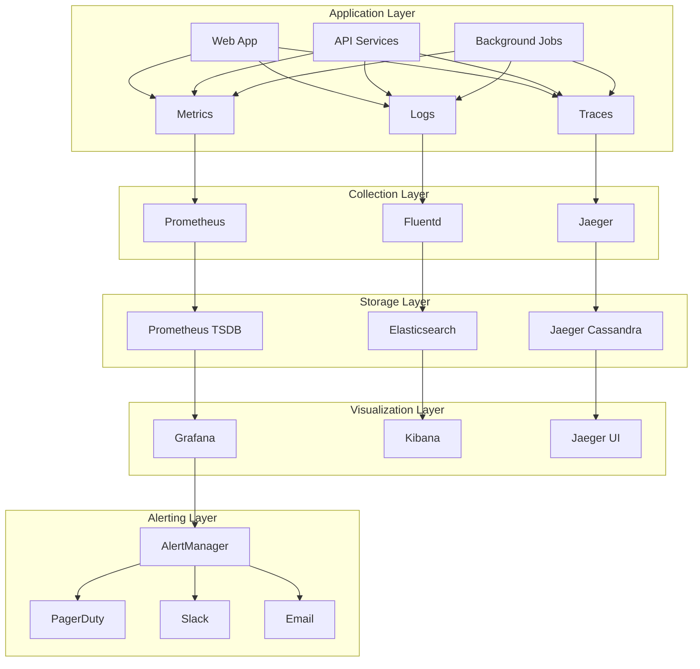

# Monitoring and Observability Strategy

## Executive Summary

This document outlines the comprehensive monitoring and observability strategy for Klear Karma's digital wellness platform. Our approach ensures system reliability, performance optimization, and proactive issue detection through modern observability practices.

### Key Objectives

- **System Reliability**: Maintain 99.9% uptime for critical services
- **Performance Monitoring**: Track and optimize application performance
- **Proactive Alerting**: Detect and respond to issues before they impact users
- **Compliance Monitoring**: Ensure adherence to healthcare data regulations
- **Business Intelligence**: Provide insights for data-driven decision making
- **Cost Optimization**: Monitor and optimize infrastructure costs

---

## Observability Framework

### Three Pillars of Observability

#### 1. Metrics
**Purpose**: Quantitative measurements of system behavior
**Tools**: Prometheus, CloudWatch, DataDog
**Retention**: 15 months for detailed metrics, 5 years for aggregated data

#### 2. Logs
**Purpose**: Detailed records of system events and transactions
**Tools**: ELK Stack (Elasticsearch, Logstash, Kibana), CloudWatch Logs
**Retention**: 90 days for application logs, 7 years for audit logs

#### 3. Traces
**Purpose**: Request flow tracking across distributed services
**Tools**: Jaeger, AWS X-Ray, OpenTelemetry
**Retention**: 30 days for detailed traces, 90 days for sampled traces

### Observability Architecture



---

## Metrics Strategy

### Application Metrics

#### Business Metrics
```yaml
# Business KPIs
business_metrics:
  user_registrations_total:
    type: counter
    description: "Total user registrations"
    labels: ["source", "user_type"]
  
  bookings_created_total:
    type: counter
    description: "Total bookings created"
    labels: ["service_type", "practitioner_id"]
  
  revenue_total:
    type: counter
    description: "Total revenue generated"
    labels: ["payment_method", "service_type"]
  
  session_duration_seconds:
    type: histogram
    description: "User session duration"
    buckets: [60, 300, 900, 1800, 3600]
```

#### Technical Metrics
```yaml
# Application Performance
technical_metrics:
  http_requests_total:
    type: counter
    description: "Total HTTP requests"
    labels: ["method", "endpoint", "status_code"]
  
  http_request_duration_seconds:
    type: histogram
    description: "HTTP request duration"
    buckets: [0.1, 0.25, 0.5, 1, 2.5, 5, 10]
  
  database_query_duration_seconds:
    type: histogram
    description: "Database query duration"
    labels: ["query_type", "table"]
  
  active_connections:
    type: gauge
    description: "Active database connections"
  
  memory_usage_bytes:
    type: gauge
    description: "Memory usage in bytes"
  
  cpu_usage_percent:
    type: gauge
    description: "CPU usage percentage"
```

### Infrastructure Metrics

```yaml
# Infrastructure Monitoring
infrastructure_metrics:
  container_cpu_usage:
    type: gauge
    description: "Container CPU usage"
    labels: ["container_name", "service"]
  
  container_memory_usage:
    type: gauge
    description: "Container memory usage"
    labels: ["container_name", "service"]
  
  disk_usage_percent:
    type: gauge
    description: "Disk usage percentage"
    labels: ["mount_point", "instance"]
  
  network_bytes_total:
    type: counter
    description: "Network bytes transferred"
    labels: ["direction", "interface"]
```

### Custom Metrics Implementation

```javascript
// metrics/collector.js
const prometheus = require('prom-client');

class MetricsCollector {
  constructor() {
    // Business metrics
    this.userRegistrations = new prometheus.Counter({
      name: 'user_registrations_total',
      help: 'Total user registrations',
      labelNames: ['source', 'user_type']
    });
    
    this.bookingsCreated = new prometheus.Counter({
      name: 'bookings_created_total',
      help: 'Total bookings created',
      labelNames: ['service_type', 'practitioner_id']
    });
    
    this.revenue = new prometheus.Counter({
      name: 'revenue_total',
      help: 'Total revenue generated',
      labelNames: ['payment_method', 'service_type']
    });
    
    // Technical metrics
    this.httpRequests = new prometheus.Counter({
      name: 'http_requests_total',
      help: 'Total HTTP requests',
      labelNames: ['method', 'endpoint', 'status_code']
    });
    
    this.httpDuration = new prometheus.Histogram({
      name: 'http_request_duration_seconds',
      help: 'HTTP request duration',
      labelNames: ['method', 'endpoint'],
      buckets: [0.1, 0.25, 0.5, 1, 2.5, 5, 10]
    });
    
    this.dbQueryDuration = new prometheus.Histogram({
      name: 'database_query_duration_seconds',
      help: 'Database query duration',
      labelNames: ['query_type', 'table'],
      buckets: [0.01, 0.05, 0.1, 0.25, 0.5, 1, 2.5]
    });
    
    this.activeConnections = new prometheus.Gauge({
      name: 'active_connections',
      help: 'Active database connections'
    });
  }
  
  recordUserRegistration(source, userType) {
    this.userRegistrations.inc({ source, user_type: userType });
  }
  
  recordBookingCreated(serviceType, practitionerId) {
    this.bookingsCreated.inc({ 
      service_type: serviceType, 
      practitioner_id: practitionerId 
    });
  }
  
  recordRevenue(amount, paymentMethod, serviceType) {
    this.revenue.inc({ 
      payment_method: paymentMethod, 
      service_type: serviceType 
    }, amount);
  }
  
  recordHttpRequest(method, endpoint, statusCode, duration) {
    this.httpRequests.inc({ method, endpoint, status_code: statusCode });
    this.httpDuration.observe({ method, endpoint }, duration);
  }
  
  recordDbQuery(queryType, table, duration) {
    this.dbQueryDuration.observe({ query_type: queryType, table }, duration);
  }
  
  updateActiveConnections(count) {
    this.activeConnections.set(count);
  }
  
  getMetrics() {
    return prometheus.register.metrics();
  }
}

module.exports = new MetricsCollector();
```

### Metrics Middleware

```javascript
// middleware/metrics.js
const metricsCollector = require('../metrics/collector');

function metricsMiddleware(req, res, next) {
  const start = Date.now();
  
  res.on('finish', () => {
    const duration = (Date.now() - start) / 1000;
    const endpoint = req.route ? req.route.path : req.path;
    
    metricsCollector.recordHttpRequest(
      req.method,
      endpoint,
      res.statusCode,
      duration
    );
  });
  
  next();
}

module.exports = metricsMiddleware;
```

---

## Logging Strategy

### Log Levels and Structure

```javascript
// utils/logger.js
const winston = require('winston');
const { ElasticsearchTransport } = require('winston-elasticsearch');

const logFormat = winston.format.combine(
  winston.format.timestamp(),
  winston.format.errors({ stack: true }),
  winston.format.json(),
  winston.format.printf(({ timestamp, level, message, ...meta }) => {
    return JSON.stringify({
      timestamp,
      level,
      message,
      service: 'klear-karma-api',
      version: process.env.APP_VERSION,
      environment: process.env.NODE_ENV,
      requestId: meta.requestId,
      userId: meta.userId,
      ...meta
    });
  })
);

const logger = winston.createLogger({
  level: process.env.LOG_LEVEL || 'info',
  format: logFormat,
  defaultMeta: {
    service: 'klear-karma-api'
  },
  transports: [
    new winston.transports.Console(),
    new winston.transports.File({ 
      filename: 'logs/error.log', 
      level: 'error' 
    }),
    new winston.transports.File({ 
      filename: 'logs/combined.log' 
    })
  ]
});

// Add Elasticsearch transport for production
if (process.env.NODE_ENV === 'production') {
  logger.add(new ElasticsearchTransport({
    level: 'info',
    clientOpts: {
      node: process.env.ELASTICSEARCH_URL,
      auth: {
        username: process.env.ELASTICSEARCH_USERNAME,
        password: process.env.ELASTICSEARCH_PASSWORD
      }
    },
    index: 'klear-karma-logs'
  }));
}

module.exports = logger;
```

### Structured Logging Examples

```javascript
// services/BookingService.js
const logger = require('../utils/logger');
const metricsCollector = require('../metrics/collector');

class BookingService {
  async createBooking(bookingData, context) {
    const { requestId, userId } = context;
    
    logger.info('Creating booking', {
      requestId,
      userId,
      practitionerId: bookingData.practitionerId,
      serviceType: bookingData.serviceType,
      scheduledAt: bookingData.scheduledAt
    });
    
    try {
      const start = Date.now();
      
      // Validate availability
      const isAvailable = await this.checkAvailability(bookingData);
      if (!isAvailable) {
        logger.warn('Booking slot not available', {
          requestId,
          userId,
          practitionerId: bookingData.practitionerId,
          scheduledAt: bookingData.scheduledAt
        });
        throw new Error('Time slot not available');
      }
      
      // Create booking
      const booking = await this.prisma.booking.create({
        data: bookingData
      });
      
      const duration = (Date.now() - start) / 1000;
      metricsCollector.recordDbQuery('INSERT', 'booking', duration);
      
      logger.info('Booking created successfully', {
        requestId,
        userId,
        bookingId: booking.id,
        practitionerId: booking.practitionerId,
        duration
      });
      
      // Record business metrics
      metricsCollector.recordBookingCreated(
        bookingData.serviceType,
        bookingData.practitionerId
      );
      
      return booking;
      
    } catch (error) {
      logger.error('Failed to create booking', {
        requestId,
        userId,
        error: error.message,
        stack: error.stack,
        bookingData
      });
      
      throw error;
    }
  }
  
  async checkAvailability(bookingData) {
    const start = Date.now();
    
    try {
      const existingBooking = await this.prisma.booking.findFirst({
        where: {
          practitionerId: bookingData.practitionerId,
          scheduledAt: bookingData.scheduledAt,
          status: { not: 'CANCELLED' }
        }
      });
      
      const duration = (Date.now() - start) / 1000;
      metricsCollector.recordDbQuery('SELECT', 'booking', duration);
      
      return !existingBooking;
      
    } catch (error) {
      logger.error('Error checking availability', {
        error: error.message,
        practitionerId: bookingData.practitionerId,
        scheduledAt: bookingData.scheduledAt
      });
      
      throw error;
    }
  }
}

module.exports = BookingService;
```

### Log Aggregation Configuration

```yaml
# fluentd/fluent.conf
<source>
  @type tail
  path /var/log/containers/*.log
  pos_file /var/log/fluentd-containers.log.pos
  tag kubernetes.*
  format json
  time_key timestamp
  time_format %Y-%m-%dT%H:%M:%S.%NZ
</source>

<filter kubernetes.**>
  @type kubernetes_metadata
</filter>

<filter kubernetes.**>
  @type parser
  key_name log
  reserve_data true
  <parse>
    @type json
  </parse>
</filter>

<match kubernetes.**>
  @type elasticsearch
  host elasticsearch.monitoring.svc.cluster.local
  port 9200
  index_name klear-karma-logs
  type_name _doc
  
  <buffer>
    @type file
    path /var/log/fluentd-buffers/kubernetes.system.buffer
    flush_mode interval
    retry_type exponential_backoff
    flush_thread_count 2
    flush_interval 5s
    retry_forever
    retry_max_interval 30
    chunk_limit_size 2M
    queue_limit_length 8
    overflow_action block
  </buffer>
</match>
```

---

## Distributed Tracing

### OpenTelemetry Configuration

```javascript
// tracing/tracer.js
const { NodeSDK } = require('@opentelemetry/sdk-node');
const { getNodeAutoInstrumentations } = require('@opentelemetry/auto-instrumentations-node');
const { JaegerExporter } = require('@opentelemetry/exporter-jaeger');
const { Resource } = require('@opentelemetry/resources');
const { SemanticResourceAttributes } = require('@opentelemetry/semantic-conventions');

const jaegerExporter = new JaegerExporter({
  endpoint: process.env.JAEGER_ENDPOINT || 'http://localhost:14268/api/traces',
});

const sdk = new NodeSDK({
  resource: new Resource({
    [SemanticResourceAttributes.SERVICE_NAME]: 'klear-karma-api',
    [SemanticResourceAttributes.SERVICE_VERSION]: process.env.APP_VERSION,
    [SemanticResourceAttributes.DEPLOYMENT_ENVIRONMENT]: process.env.NODE_ENV,
  }),
  traceExporter: jaegerExporter,
  instrumentations: [getNodeAutoInstrumentations({
    '@opentelemetry/instrumentation-fs': {
      enabled: false,
    },
  })],
});

sdk.start();

module.exports = sdk;
```

### Custom Span Creation

```javascript
// services/PaymentService.js
const { trace } = require('@opentelemetry/api');
const logger = require('../utils/logger');

class PaymentService {
  constructor() {
    this.tracer = trace.getTracer('payment-service');
  }
  
  async processPayment(paymentData, context) {
    const span = this.tracer.startSpan('payment.process', {
      attributes: {
        'payment.amount': paymentData.amount,
        'payment.currency': paymentData.currency,
        'payment.method': paymentData.method,
        'user.id': context.userId
      }
    });
    
    try {
      // Validate payment data
      const validationSpan = this.tracer.startSpan('payment.validate', {
        parent: span
      });
      
      await this.validatePaymentData(paymentData);
      validationSpan.setStatus({ code: 1 }); // OK
      validationSpan.end();
      
      // Process with payment provider
      const providerSpan = this.tracer.startSpan('payment.provider.charge', {
        parent: span,
        attributes: {
          'payment.provider': 'stripe'
        }
      });
      
      const charge = await this.chargePayment(paymentData);
      providerSpan.setAttributes({
        'payment.transaction_id': charge.id,
        'payment.status': charge.status
      });
      providerSpan.setStatus({ code: 1 }); // OK
      providerSpan.end();
      
      // Record transaction
      const recordSpan = this.tracer.startSpan('payment.record', {
        parent: span
      });
      
      const transaction = await this.recordTransaction(charge, paymentData);
      recordSpan.setAttributes({
        'transaction.id': transaction.id
      });
      recordSpan.setStatus({ code: 1 }); // OK
      recordSpan.end();
      
      span.setAttributes({
        'payment.success': true,
        'payment.transaction_id': transaction.id
      });
      span.setStatus({ code: 1 }); // OK
      
      logger.info('Payment processed successfully', {
        requestId: context.requestId,
        userId: context.userId,
        transactionId: transaction.id,
        amount: paymentData.amount,
        traceId: span.spanContext().traceId
      });
      
      return transaction;
      
    } catch (error) {
      span.recordException(error);
      span.setStatus({ 
        code: 2, // ERROR
        message: error.message 
      });
      
      logger.error('Payment processing failed', {
        requestId: context.requestId,
        userId: context.userId,
        error: error.message,
        traceId: span.spanContext().traceId
      });
      
      throw error;
    } finally {
      span.end();
    }
  }
}

module.exports = PaymentService;
```

---

## Alerting Strategy

### Alert Rules Configuration

```yaml
# prometheus/alert-rules.yml
groups:
  - name: application.rules
    rules:
      # High error rate
      - alert: HighErrorRate
        expr: |
          (
            sum(rate(http_requests_total{status_code=~"5.."}[5m])) /
            sum(rate(http_requests_total[5m]))
          ) > 0.05
        for: 2m
        labels:
          severity: critical
          team: backend
        annotations:
          summary: "High error rate detected"
          description: "Error rate is {{ $value | humanizePercentage }} for the last 5 minutes"
      
      # High response time
      - alert: HighResponseTime
        expr: |
          histogram_quantile(0.95, 
            sum(rate(http_request_duration_seconds_bucket[5m])) by (le)
          ) > 2
        for: 5m
        labels:
          severity: warning
          team: backend
        annotations:
          summary: "High response time detected"
          description: "95th percentile response time is {{ $value }}s"
      
      # Database connection issues
      - alert: DatabaseConnectionHigh
        expr: active_connections > 80
        for: 3m
        labels:
          severity: warning
          team: backend
        annotations:
          summary: "High database connection count"
          description: "Database connections: {{ $value }}"
      
      # Memory usage
      - alert: HighMemoryUsage
        expr: |
          (
            container_memory_usage_bytes{container_name!="POD"} /
            container_spec_memory_limit_bytes
          ) > 0.9
        for: 5m
        labels:
          severity: warning
          team: infrastructure
        annotations:
          summary: "High memory usage"
          description: "Memory usage is {{ $value | humanizePercentage }} for container {{ $labels.container_name }}"
      
      # Disk space
      - alert: DiskSpaceLow
        expr: |
          (
            node_filesystem_avail_bytes{mountpoint="/"} /
            node_filesystem_size_bytes{mountpoint="/"}
          ) < 0.1
        for: 5m
        labels:
          severity: critical
          team: infrastructure
        annotations:
          summary: "Low disk space"
          description: "Disk space is {{ $value | humanizePercentage }} full"

  - name: business.rules
    rules:
      # Low booking rate
      - alert: LowBookingRate
        expr: |
          sum(increase(bookings_created_total[1h])) < 10
        for: 30m
        labels:
          severity: warning
          team: product
        annotations:
          summary: "Low booking rate"
          description: "Only {{ $value }} bookings created in the last hour"
      
      # Payment failures
      - alert: HighPaymentFailureRate
        expr: |
          (
            sum(increase(payment_attempts_total{status="failed"}[5m])) /
            sum(increase(payment_attempts_total[5m]))
          ) > 0.1
        for: 5m
        labels:
          severity: critical
          team: payments
        annotations:
          summary: "High payment failure rate"
          description: "Payment failure rate is {{ $value | humanizePercentage }}"
```

### AlertManager Configuration

```yaml
# alertmanager/alertmanager.yml
global:
  smtp_smarthost: 'smtp.gmail.com:587'
  smtp_from: 'alerts@klearkarma.com'
  smtp_auth_username: 'alerts@klearkarma.com'
  smtp_auth_password: '${SMTP_PASSWORD}'

route:
  group_by: ['alertname', 'cluster', 'service']
  group_wait: 10s
  group_interval: 10s
  repeat_interval: 1h
  receiver: 'default'
  routes:
    - match:
        severity: critical
      receiver: 'critical-alerts'
      group_wait: 0s
      repeat_interval: 5m
    
    - match:
        team: backend
      receiver: 'backend-team'
    
    - match:
        team: infrastructure
      receiver: 'infrastructure-team'
    
    - match:
        team: product
      receiver: 'product-team'

receivers:
  - name: 'default'
    email_configs:
      - to: 'alerts@klearkarma.com'
        subject: '[Klear Karma] {{ .GroupLabels.alertname }}'
        body: |
          {{ range .Alerts }}
          Alert: {{ .Annotations.summary }}
          Description: {{ .Annotations.description }}
          Labels: {{ range .Labels.SortedPairs }}{{ .Name }}={{ .Value }} {{ end }}
          {{ end }}
  
  - name: 'critical-alerts'
    pagerduty_configs:
      - service_key: '${PAGERDUTY_SERVICE_KEY}'
        description: '{{ .GroupLabels.alertname }}: {{ .CommonAnnotations.summary }}'
    slack_configs:
      - api_url: '${SLACK_WEBHOOK_URL}'
        channel: '#alerts-critical'
        title: 'Critical Alert: {{ .GroupLabels.alertname }}'
        text: '{{ .CommonAnnotations.description }}'
        color: 'danger'
  
  - name: 'backend-team'
    slack_configs:
      - api_url: '${SLACK_WEBHOOK_URL}'
        channel: '#backend-alerts'
        title: 'Backend Alert: {{ .GroupLabels.alertname }}'
        text: '{{ .CommonAnnotations.description }}'
        color: 'warning'
  
  - name: 'infrastructure-team'
    slack_configs:
      - api_url: '${SLACK_WEBHOOK_URL}'
        channel: '#infrastructure-alerts'
        title: 'Infrastructure Alert: {{ .GroupLabels.alertname }}'
        text: '{{ .CommonAnnotations.description }}'
        color: 'warning'
  
  - name: 'product-team'
    email_configs:
      - to: 'product@klearkarma.com'
        subject: '[Product Alert] {{ .GroupLabels.alertname }}'
        body: |
          {{ .CommonAnnotations.description }}
          
          Dashboard: https://grafana.klearkarma.com/d/business-metrics

inhibit_rules:
  - source_match:
      severity: 'critical'
    target_match:
      severity: 'warning'
    equal: ['alertname', 'cluster', 'service']
```

---

## Dashboard Strategy

### Grafana Dashboard Configuration

```json
{
  "dashboard": {
    "id": null,
    "title": "Klear Karma - Application Overview",
    "tags": ["klear-karma", "overview"],
    "timezone": "browser",
    "panels": [
      {
        "id": 1,
        "title": "Request Rate",
        "type": "stat",
        "targets": [
          {
            "expr": "sum(rate(http_requests_total[5m]))",
            "legendFormat": "Requests/sec"
          }
        ],
        "fieldConfig": {
          "defaults": {
            "unit": "reqps",
            "color": {
              "mode": "thresholds"
            },
            "thresholds": {
              "steps": [
                {"color": "green", "value": null},
                {"color": "yellow", "value": 100},
                {"color": "red", "value": 500}
              ]
            }
          }
        },
        "gridPos": {"h": 8, "w": 6, "x": 0, "y": 0}
      },
      {
        "id": 2,
        "title": "Error Rate",
        "type": "stat",
        "targets": [
          {
            "expr": "sum(rate(http_requests_total{status_code=~\"5..\"}[5m])) / sum(rate(http_requests_total[5m]))",
            "legendFormat": "Error Rate"
          }
        ],
        "fieldConfig": {
          "defaults": {
            "unit": "percentunit",
            "color": {
              "mode": "thresholds"
            },
            "thresholds": {
              "steps": [
                {"color": "green", "value": null},
                {"color": "yellow", "value": 0.01},
                {"color": "red", "value": 0.05}
              ]
            }
          }
        },
        "gridPos": {"h": 8, "w": 6, "x": 6, "y": 0}
      },
      {
        "id": 3,
        "title": "Response Time (95th percentile)",
        "type": "stat",
        "targets": [
          {
            "expr": "histogram_quantile(0.95, sum(rate(http_request_duration_seconds_bucket[5m])) by (le))",
            "legendFormat": "95th percentile"
          }
        ],
        "fieldConfig": {
          "defaults": {
            "unit": "s",
            "color": {
              "mode": "thresholds"
            },
            "thresholds": {
              "steps": [
                {"color": "green", "value": null},
                {"color": "yellow", "value": 1},
                {"color": "red", "value": 2}
              ]
            }
          }
        },
        "gridPos": {"h": 8, "w": 6, "x": 12, "y": 0}
      },
      {
        "id": 4,
        "title": "Active Users",
        "type": "stat",
        "targets": [
          {
            "expr": "sum(active_sessions)",
            "legendFormat": "Active Sessions"
          }
        ],
        "fieldConfig": {
          "defaults": {
            "unit": "short",
            "color": {
              "mode": "palette-classic"
            }
          }
        },
        "gridPos": {"h": 8, "w": 6, "x": 18, "y": 0}
      },
      {
        "id": 5,
        "title": "Request Rate by Endpoint",
        "type": "timeseries",
        "targets": [
          {
            "expr": "sum(rate(http_requests_total[5m])) by (endpoint)",
            "legendFormat": "{{endpoint}}"
          }
        ],
        "fieldConfig": {
          "defaults": {
            "unit": "reqps",
            "custom": {
              "drawStyle": "line",
              "lineInterpolation": "linear",
              "lineWidth": 1,
              "fillOpacity": 10,
              "gradientMode": "none",
              "spanNulls": false,
              "pointSize": 5,
              "stacking": {"mode": "none", "group": "A"},
              "axisPlacement": "auto",
              "axisLabel": "",
              "scaleDistribution": {"type": "linear"}
            }
          }
        },
        "gridPos": {"h": 8, "w": 12, "x": 0, "y": 8}
      },
      {
        "id": 6,
        "title": "Database Query Performance",
        "type": "timeseries",
        "targets": [
          {
            "expr": "histogram_quantile(0.95, sum(rate(database_query_duration_seconds_bucket[5m])) by (le, query_type))",
            "legendFormat": "{{query_type}} - 95th percentile"
          },
          {
            "expr": "histogram_quantile(0.50, sum(rate(database_query_duration_seconds_bucket[5m])) by (le, query_type))",
            "legendFormat": "{{query_type}} - 50th percentile"
          }
        ],
        "fieldConfig": {
          "defaults": {
            "unit": "s",
            "custom": {
              "drawStyle": "line",
              "lineInterpolation": "linear",
              "lineWidth": 1,
              "fillOpacity": 10
            }
          }
        },
        "gridPos": {"h": 8, "w": 12, "x": 12, "y": 8}
      }
    ],
    "time": {
      "from": "now-1h",
      "to": "now"
    },
    "refresh": "5s"
  }
}
```

### Business Metrics Dashboard

```json
{
  "dashboard": {
    "title": "Klear Karma - Business Metrics",
    "panels": [
      {
        "title": "Daily Active Users",
        "type": "stat",
        "targets": [
          {
            "expr": "count(count by (user_id) (increase(user_sessions_total[24h])))",
            "legendFormat": "DAU"
          }
        ]
      },
      {
        "title": "Bookings Created",
        "type": "timeseries",
        "targets": [
          {
            "expr": "sum(increase(bookings_created_total[1h])) by (service_type)",
            "legendFormat": "{{service_type}}"
          }
        ]
      },
      {
        "title": "Revenue",
        "type": "timeseries",
        "targets": [
          {
            "expr": "sum(increase(revenue_total[1h]))",
            "legendFormat": "Hourly Revenue"
          }
        ]
      },
      {
        "title": "Conversion Funnel",
        "type": "bargauge",
        "targets": [
          {
            "expr": "sum(increase(user_registrations_total[24h]))",
            "legendFormat": "Registrations"
          },
          {
            "expr": "sum(increase(practitioner_views_total[24h]))",
            "legendFormat": "Practitioner Views"
          },
          {
            "expr": "sum(increase(bookings_created_total[24h]))",
            "legendFormat": "Bookings"
          },
          {
            "expr": "sum(increase(payments_completed_total[24h]))",
            "legendFormat": "Payments"
          }
        ]
      }
    ]
  }
}
```

---

## Health Checks and SLIs/SLOs

### Service Health Checks

```javascript
// routes/health.js
const express = require('express');
const router = express.Router();
const { PrismaClient } = require('@prisma/client');
const redis = require('../config/redis');
const logger = require('../utils/logger');

const prisma = new PrismaClient();

// Basic health check
router.get('/health', (req, res) => {
  res.status(200).json({
    status: 'healthy',
    timestamp: new Date().toISOString(),
    version: process.env.APP_VERSION
  });
});

// Detailed health check
router.get('/health/detailed', async (req, res) => {
  const checks = {
    database: false,
    redis: false,
    memory: false,
    disk: false
  };
  
  let overallStatus = 'healthy';
  
  try {
    // Database check
    await prisma.$queryRaw`SELECT 1`;
    checks.database = true;
  } catch (error) {
    logger.error('Database health check failed', { error: error.message });
    overallStatus = 'unhealthy';
  }
  
  try {
    // Redis check
    await redis.ping();
    checks.redis = true;
  } catch (error) {
    logger.error('Redis health check failed', { error: error.message });
    overallStatus = 'degraded';
  }
  
  // Memory check
  const memUsage = process.memoryUsage();
  const memUsagePercent = (memUsage.heapUsed / memUsage.heapTotal) * 100;
  checks.memory = memUsagePercent < 90;
  
  if (!checks.memory) {
    logger.warn('High memory usage detected', { memUsagePercent });
    if (overallStatus === 'healthy') overallStatus = 'degraded';
  }
  
  // Disk check (simplified)
  checks.disk = true; // Would implement actual disk space check
  
  const statusCode = overallStatus === 'healthy' ? 200 : 
                    overallStatus === 'degraded' ? 200 : 503;
  
  res.status(statusCode).json({
    status: overallStatus,
    timestamp: new Date().toISOString(),
    version: process.env.APP_VERSION,
    checks,
    metrics: {
      uptime: process.uptime(),
      memory: memUsage,
      cpu: process.cpuUsage()
    }
  });
});

// Readiness check
router.get('/ready', async (req, res) => {
  try {
    // Check if all critical dependencies are available
    await prisma.$queryRaw`SELECT 1`;
    await redis.ping();
    
    res.status(200).json({
      status: 'ready',
      timestamp: new Date().toISOString()
    });
  } catch (error) {
    logger.error('Readiness check failed', { error: error.message });
    res.status(503).json({
      status: 'not ready',
      timestamp: new Date().toISOString(),
      error: error.message
    });
  }
});

// Liveness check
router.get('/live', (req, res) => {
  res.status(200).json({
    status: 'alive',
    timestamp: new Date().toISOString()
  });
});

module.exports = router;
```

### SLI/SLO Definitions

```yaml
# slo-definitions.yml
slos:
  availability:
    description: "Service availability"
    target: 99.9%
    measurement_window: 30d
    sli_query: |
      (
        sum(rate(http_requests_total{status_code!~"5.."}[30d])) /
        sum(rate(http_requests_total[30d]))
      ) * 100
  
  latency:
    description: "95th percentile response time"
    target: "< 500ms"
    measurement_window: 7d
    sli_query: |
      histogram_quantile(0.95,
        sum(rate(http_request_duration_seconds_bucket[7d])) by (le)
      )
  
  error_rate:
    description: "Error rate"
    target: "< 1%"
    measurement_window: 7d
    sli_query: |
      (
        sum(rate(http_requests_total{status_code=~"5.."}[7d])) /
        sum(rate(http_requests_total[7d]))
      ) * 100
  
  booking_success_rate:
    description: "Booking creation success rate"
    target: "> 99%"
    measurement_window: 24h
    sli_query: |
      (
        sum(increase(bookings_created_total[24h])) /
        sum(increase(booking_attempts_total[24h]))
      ) * 100
  
  payment_success_rate:
    description: "Payment processing success rate"
    target: "> 98%"
    measurement_window: 24h
    sli_query: |
      (
        sum(increase(payments_completed_total[24h])) /
        sum(increase(payment_attempts_total[24h]))
      ) * 100
```

---

## Incident Response

### Incident Response Playbook

```markdown
# Incident Response Playbook

## Severity Levels

### SEV-1 (Critical)
- Complete service outage
- Data breach or security incident
- Payment processing failure
- Response time: 15 minutes
- Escalation: Immediate

### SEV-2 (High)
- Partial service degradation
- High error rates (>5%)
- Performance issues affecting users
- Response time: 1 hour
- Escalation: 2 hours

### SEV-3 (Medium)
- Minor service issues
- Non-critical feature failures
- Response time: 4 hours
- Escalation: 24 hours

### SEV-4 (Low)
- Cosmetic issues
- Documentation updates
- Response time: 24 hours
- Escalation: 72 hours

## Response Procedures

### Initial Response (0-15 minutes)
1. Acknowledge the incident
2. Assess severity level
3. Create incident channel (#incident-YYYY-MM-DD-HH-MM)
4. Notify stakeholders based on severity
5. Begin investigation

### Investigation (15-60 minutes)
1. Check monitoring dashboards
2. Review recent deployments
3. Analyze logs and traces
4. Identify root cause
5. Implement temporary fix if possible

### Resolution (1+ hours)
1. Implement permanent fix
2. Verify resolution
3. Monitor for regression
4. Update stakeholders
5. Document incident

### Post-Incident (24-48 hours)
1. Conduct post-mortem
2. Identify action items
3. Update runbooks
4. Implement preventive measures
```

### Incident Management Scripts

```bash
#!/bin/bash
# scripts/incident-response.sh

set -e

INCIDENT_ID="incident-$(date +%Y%m%d-%H%M)"
SEVERITY=${1:-"SEV-3"}
DESCRIPTION=${2:-"Incident detected"}

echo "Creating incident: $INCIDENT_ID"
echo "Severity: $SEVERITY"
echo "Description: $DESCRIPTION"

# Create incident channel
slack_create_channel() {
  curl -X POST "https://slack.com/api/conversations.create" \
    -H "Authorization: Bearer $SLACK_BOT_TOKEN" \
    -H "Content-Type: application/json" \
    -d "{
      \"name\": \"$INCIDENT_ID\",
      \"is_private\": false
    }"
}

# Notify stakeholders
notify_stakeholders() {
  case $SEVERITY in
    "SEV-1")
      # Page on-call engineer
      curl -X POST "https://events.pagerduty.com/v2/enqueue" \
        -H "Content-Type: application/json" \
        -d "{
          \"routing_key\": \"$PAGERDUTY_ROUTING_KEY\",
          \"event_action\": \"trigger\",
          \"dedup_key\": \"$INCIDENT_ID\",
          \"payload\": {
            \"summary\": \"$DESCRIPTION\",
            \"severity\": \"critical\",
            \"source\": \"monitoring\"
          }
        }"
      ;;
    "SEV-2")
      # Notify team leads
      curl -X POST "$SLACK_WEBHOOK_URL" \
        -H "Content-Type: application/json" \
        -d "{
          \"channel\": \"#alerts\",
          \"text\": \"SEV-2 Incident: $DESCRIPTION\",
          \"color\": \"warning\"
        }"
      ;;
  esac
}

# Gather initial data
gather_data() {
  echo "Gathering incident data..."
  
  # System status
  kubectl get pods -n klear-karma > "/tmp/${INCIDENT_ID}-pods.txt"
  
  # Recent logs
  kubectl logs -n klear-karma -l app=api --since=30m > "/tmp/${INCIDENT_ID}-logs.txt"
  
  # Metrics snapshot
  curl -s "http://prometheus:9090/api/v1/query?query=up" > "/tmp/${INCIDENT_ID}-metrics.json"
  
  echo "Data gathered in /tmp/${INCIDENT_ID}-*"
}

# Main execution
slack_create_channel
notify_stakeholders
gather_data

echo "Incident $INCIDENT_ID created successfully"
echo "Next steps:"
echo "1. Join #$INCIDENT_ID channel"
echo "2. Review gathered data in /tmp/"
echo "3. Begin investigation"
```

---

## Cost Monitoring

### AWS Cost Monitoring

```javascript
// scripts/cost-monitoring.js
const AWS = require('aws-sdk');
const costExplorer = new AWS.CostExplorer({ region: 'us-east-1' });
const cloudWatch = new AWS.CloudWatch({ region: 'us-east-1' });

class CostMonitor {
  async getDailyCosts() {
    const endDate = new Date();
    const startDate = new Date(endDate.getTime() - 30 * 24 * 60 * 60 * 1000);
    
    const params = {
      TimePeriod: {
        Start: startDate.toISOString().split('T')[0],
        End: endDate.toISOString().split('T')[0]
      },
      Granularity: 'DAILY',
      Metrics: ['BlendedCost'],
      GroupBy: [
        {
          Type: 'DIMENSION',
          Key: 'SERVICE'
        }
      ]
    };
    
    try {
      const result = await costExplorer.getCostAndUsage(params).promise();
      return this.processCostData(result);
    } catch (error) {
      console.error('Error fetching cost data:', error);
      throw error;
    }
  }
  
  processCostData(data) {
    const costs = {};
    
    data.ResultsByTime.forEach(timeResult => {
      const date = timeResult.TimePeriod.Start;
      costs[date] = {};
      
      timeResult.Groups.forEach(group => {
        const service = group.Keys[0];
        const cost = parseFloat(group.Metrics.BlendedCost.Amount);
        costs[date][service] = cost;
      });
    });
    
    return costs;
  }
  
  async publishCostMetrics(costs) {
    const today = new Date().toISOString().split('T')[0];
    const todayCosts = costs[today] || {};
    
    for (const [service, cost] of Object.entries(todayCosts)) {
      const params = {
        Namespace: 'KlearKarma/Costs',
        MetricData: [
          {
            MetricName: 'DailyCost',
            Dimensions: [
              {
                Name: 'Service',
                Value: service
              }
            ],
            Value: cost,
            Unit: 'None',
            Timestamp: new Date()
          }
        ]
      };
      
      try {
        await cloudWatch.putMetricData(params).promise();
        console.log(`Published cost metric for ${service}: $${cost}`);
      } catch (error) {
        console.error(`Error publishing metric for ${service}:`, error);
      }
    }
  }
  
  async checkCostAlerts() {
    const costs = await this.getDailyCosts();
    const today = new Date().toISOString().split('T')[0];
    const todayCosts = costs[today] || {};
    
    const totalCost = Object.values(todayCosts).reduce((sum, cost) => sum + cost, 0);
    const dailyBudget = 500; // $500 daily budget
    
    if (totalCost > dailyBudget) {
      await this.sendCostAlert(totalCost, dailyBudget, todayCosts);
    }
    
    return { totalCost, budget: dailyBudget, breakdown: todayCosts };
  }
  
  async sendCostAlert(actualCost, budget, breakdown) {
    const message = {
      text: `🚨 Daily cost budget exceeded!`,
      attachments: [
        {
          color: 'danger',
          fields: [
            {
              title: 'Actual Cost',
              value: `$${actualCost.toFixed(2)}`,
              short: true
            },
            {
              title: 'Budget',
              value: `$${budget.toFixed(2)}`,
              short: true
            },
            {
              title: 'Overage',
              value: `$${(actualCost - budget).toFixed(2)}`,
              short: true
            }
          ]
        },
        {
          title: 'Cost Breakdown',
          text: Object.entries(breakdown)
            .sort(([,a], [,b]) => b - a)
            .map(([service, cost]) => `${service}: $${cost.toFixed(2)}`)
            .join('\n')
        }
      ]
    };
    
    // Send to Slack
    const response = await fetch(process.env.SLACK_WEBHOOK_URL, {
      method: 'POST',
      headers: { 'Content-Type': 'application/json' },
      body: JSON.stringify(message)
    });
    
    if (!response.ok) {
      throw new Error(`Failed to send cost alert: ${response.statusText}`);
    }
  }
}

// Usage
if (require.main === module) {
  const monitor = new CostMonitor();
  
  monitor.checkCostAlerts()
    .then(result => {
      console.log('Cost check completed:', result);
      process.exit(0);
    })
    .catch(error => {
      console.error('Cost check failed:', error);
      process.exit(1);
    });
}

module.exports = CostMonitor;
```

---

## Conclusion

This monitoring and observability strategy provides comprehensive coverage for Klear Karma's digital wellness platform, ensuring:

### Key Benefits

- **Proactive Issue Detection**: Early warning systems prevent user-facing problems
- **Performance Optimization**: Detailed metrics enable continuous performance improvements
- **Compliance Monitoring**: Automated tracking of healthcare data regulations
- **Cost Control**: Real-time cost monitoring and budget alerts
- **Incident Response**: Structured approach to incident management and resolution

### Success Metrics

- **MTTD (Mean Time to Detection)**: < 2 minutes for critical issues
- **MTTR (Mean Time to Resolution)**: < 15 minutes for SEV-1, < 1 hour for SEV-2
- **SLO Compliance**: 99.9% availability, <500ms 95th percentile response time
- **Cost Efficiency**: Stay within 5% of monthly budget
- **Alert Accuracy**: <2% false positive rate

### Continuous Improvement

- Regular review of alert thresholds and SLOs
- Analysis of incident patterns and root causes
- Integration of new monitoring tools and techniques
- Team training on observability best practices
- Feedback incorporation from production incidents

For questions or suggestions regarding the monitoring strategy, contact the DevOps team or refer to the internal monitoring documentation.